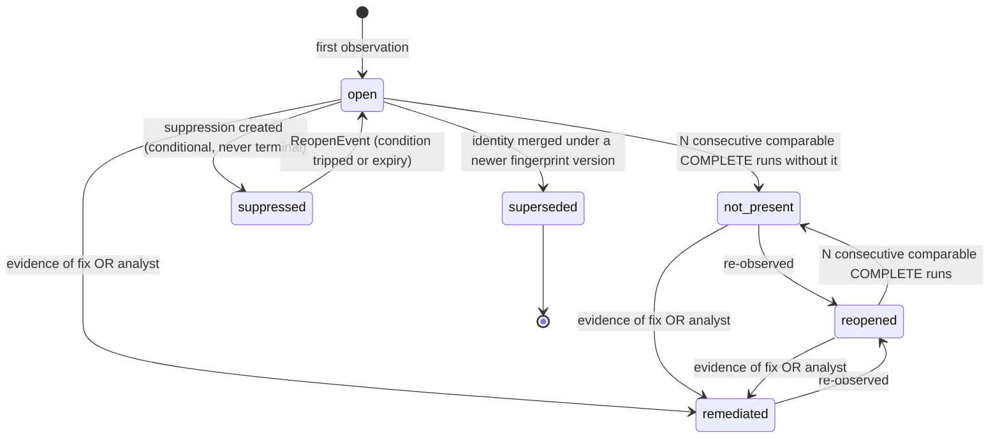
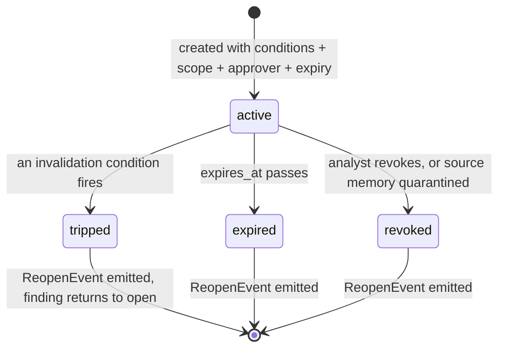
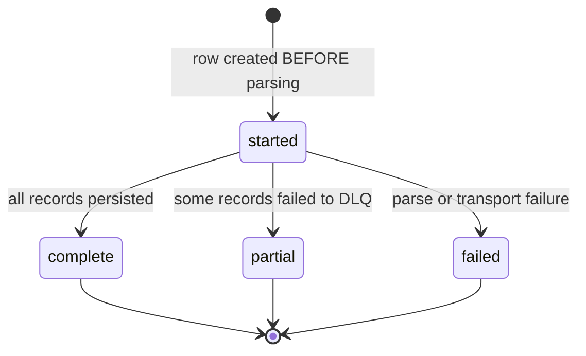
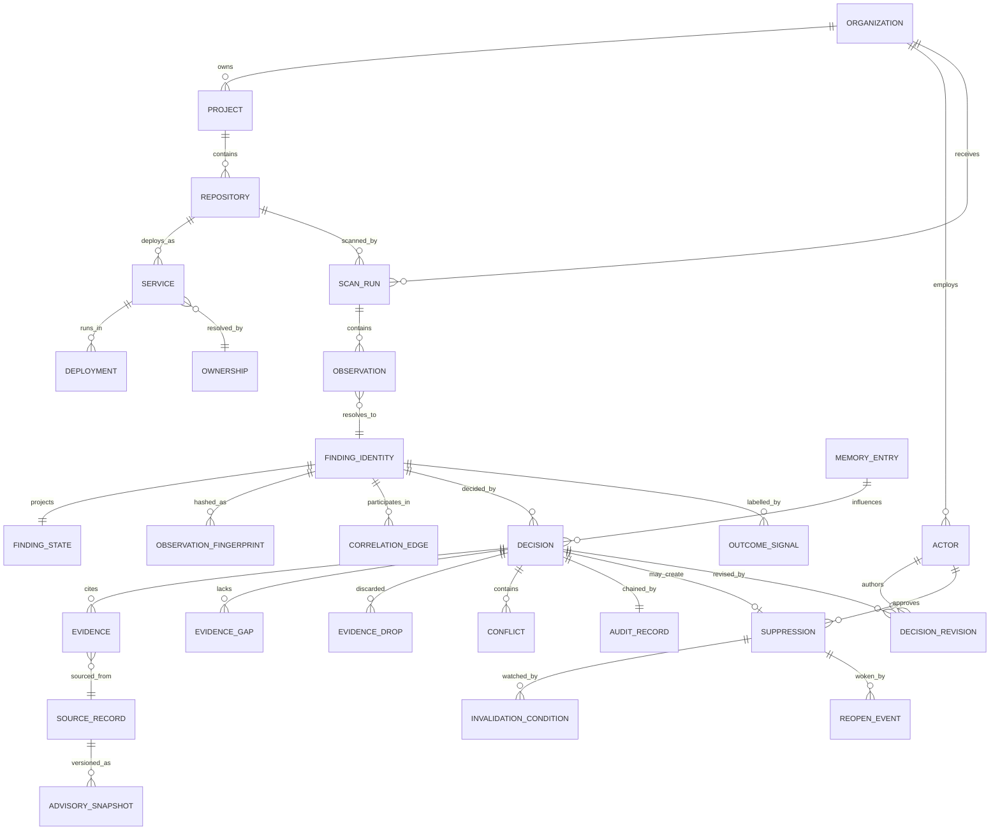

# Domain Model — SDIP

**Deliverable:** CLAUDE.md §46.E
**Date:** 2026-08-14
**Status:** Design. Binding on the database model (§46.F) and the API contracts (§46.G).
**Governed by:** ADR-0001 … ADR-0017. Where this document and a critique disagree, the ADR wins.

---

## 0. How to read this

The domain has one organizing idea, and every entity below is a consequence of it:

> **A finding is not a row. It is an identity, a stream of observations, a projected state, and a history of decisions — each with a different lifetime, a different mutation rate, and a different correctness requirement.**

Fusing them (the obvious design, and the one CLAUDE.md §24 implies) makes the product's central claim — *"when the world changes, the decision comes back, with what you knew at the time"* — unbuildable. ADR-0001 and ADR-0016 are the two ADRs that shape everything here.

---

## 1. Ubiquitous language

The single largest source of confusion in this domain is that "finding" means five things. It is banned as a bare noun in code, schema and API.

| Term | Definition | Not to be confused with |
|---|---|---|
| **Observation** | An immutable historical fact: *tool T, version V, reported X at location L during scan run R at time τ.* Never updated, never deleted before retention expiry | Finding |
| **Finding Identity** | The stable thing observations are *about*, produced by a versioned pure function over an observation | Observation, State |
| **Finding State** | The current projected lifecycle of an identity: `open`, `reopened`, `not_present`, `remediated`, `suppressed`, `expired`, `superseded` | Decision. **`open` is a fact; `prioritize` is an opinion** |
| **Decision** | An immutable record combining a deterministic assessment, a model recommendation, and a policy outcome — plus the evidence and epistemic state at that moment | Finding State, Disposition |
| **Disposition** | The policy outcome carried by a decision (`prioritize` / `deprioritize` / `needs_review` / …) | Decision (the record), State (the fact) |
| **Suppression** | A *conditional* state saying "not now, unless…", carrying invalidation conditions, a scope, an approver and an expiry. **Never terminal** (ADR-0016) | Disposition |
| **Evidence** | A retrieved, content-hashed, version-pinned record with an authority tier, attached to a decision | Enrichment |
| **Evidence Gap** | A *required* slot that could not be filled. A first-class object, not silence | Missing data |
| **Correlation Edge** | An append-only assertion that two identities are related, at a stated algorithm version | Cluster |
| **Cluster** | A *versioned materialization* derived from edges. Disposable and recomputable | Merge — **findings are never merged** |
| **Re-litigation** | The event of a closed decision being re-opened because an invalidation condition tripped | Rescan, re-analysis |
| **Decision Debt** | The set of closed decisions whose justification has silently expired | Backlog |

---

## 2. Bounded contexts

Revised from CLAUDE.md §20. Three of its ten "pillars" collapse (Context Engine, Context Builder and Evidence Engine are one function) and two are deferred (Pattern Discovery, Learning Engine as a subsystem).

```
domain/
  organizations/     Organization, Project, Actor, Membership
  assets/            Repository, Service, Asset, Deployment, Environment, Ownership
  ingestion/         ScanRun, Observation, RawPayloadRef
  findings/          FindingIdentity, Fingerprint, FindingState
  correlation/       CorrelationEdge, ClusterMaterialization, IdentityAlias
  evidence/          Evidence, EvidenceSlot, EvidenceGap, EvidenceDrop, Conflict,
                     SourceRecord, AdvisorySnapshot, CodeFlow
  decisions/         DeterministicAssessment, ModelRecommendation, PolicyDecision,
                     Decision, DecisionRevision, AuditRecord
  suppressions/      Suppression, InvalidationCondition, SuppressionScope, ReopenEvent
  knowledge/         MemoryEntry, RuleDispositionStats, Calibrator, ExternalSourceVersion
  governance/        Policy, SlaClock, CostBudget, UsageLedger
```

```
application/
  ingestion/     parse → redact → persist observations → resolve identity (tier 0)
  correlation/   blocking → candidate edges → materialize clusters
  scoring/       deterministic risk features → score (versioned)
  prefilter/     deterministic disposition — the stage that decides whether a model runs at all
  retrieval/     evidence contract: slot filling, hybrid search for free-text slots, ranking, budget
  policy/        the decision authority. Deterministic, versioned, unit-tested
  analysis/      model invocation, grounding validation, differential decisioning
  relitigation/  delta detection over external state; suppression wake-up
  learning/      decision revisions, audit sampling, retroactive labels, calibration fitting
  reprocessing/  versioned recompute, shadow diff, promotion
  reporting/     decision debt, metrics, exports
```

```
infrastructure/  database, cache, vector, llm, integrations, external_knowledge, audit, redaction
interfaces/      api, workers
```

### Runtime processes — one image, five entrypoints

| Process | Responsibility | Why separate |
|---|---|---|
| `api` | Ingest endpoints, query, feedback | Latency profile, request-scoped auth |
| `ingest-worker` | Parse → redact → persist → resolve identity | Burst load, large payloads, **holds tenant credentials** |
| `correlate-worker` | Blocking, edges, materialization | CPU-bound, re-runnable |
| `analyze-worker` | Pre-filter → evidence assembly → model call → policy | **Talks to the model provider; processes untrusted content.** Must not reach the credential store (ADR-0011) |
| `watch-worker` | Delta detection, freshness sweep, retroactive labels, audit sampling, SLA clocks | Scheduled; this is the process that delivers the product's core claim |

`ingest-worker` and `analyze-worker` are separated for a security reason, not a scaling one: a prompt-injection-driven SSRF in the analysis path must be structurally unable to reach the Git provider or the credential vault.

---

## 3. Aggregates

An aggregate is a transactional consistency boundary. There are six.

### 3.1 `Organization` — the tenant root

Everything below is scoped to it. Not an aggregate in the transactional sense so much as a **partition key that appears in every identity, every index, every cache key and every RLS predicate** (ADR-0003).

**Invariant I1 — Tenant closure.** No entity may reference an entity belonging to a different organization. This is enforced three times: in the type system (org-scoped repository interfaces), in the database (RLS FORCE), and in CI (the isolation suite). One enforcement point is not enough, because the failure is silent and plausible.

### 3.2 `ScanRun` — the ingest boundary

**Root:** `ScanRun`. **Contains:** `Observation` (many), `RawPayloadRef`.

| Field | Notes |
|---|---|
| `idempotency_key` | Unique per org. Created **before** parsing (ADR-0005) |
| `tool`, `tool_version`, `ruleset_version`, `ruleset_hash` | Required for drift segmentation (ADR-0013) |
| `repo_id`, `commit_sha`, `scope_hash` | `scope_hash` canonicalizes paths scanned + ruleset + configuration |
| `status` | `started` → `complete` \| `partial` \| `failed` |
| `finding_count`, `truncation_summary` | |

**Invariants**

- **I2 — Observations are immutable.** No `UPDATE`, no `DELETE` before retention expiry. Enforced by database grant, not by the ORM.
- **I3 — Observations exist only inside a scan run.** There is no orphan observation and no "manual finding" path that bypasses this.
- **I4 — Only `complete` runs count as evidence of absence.** A `partial` or `failed` run contributes nothing to lifecycle transitions (ADR-0002). This single rule prevents the worst bug this product class ships.
- **I5 — Comparability is explicit.** Two runs are comparable only if `scope_hash` and `tool_version` match. Absence counting operates over comparable runs only.

### 3.3 `FindingIdentity` — the correlation and lifecycle boundary

**Root:** `FindingIdentity`. **Contains:** `Fingerprint` (many, one per version), `FindingState` (one, a projection).

**Identity is a versioned pure function**, `fingerprint_v{n}(observation) -> bytes`. Because algorithm v2 may split or merge what v1 saw as one thing, identity is modelled **per fingerprint version**, with an alias table reconciling across versions:

```
FindingIdentity(id, org_id, fingerprint_version, fingerprint, class, first_observed_at)
    unique (org_id, fingerprint_version, fingerprint)

ObservationFingerprint(org_id, observation_id, fingerprint_version, fingerprint)
    -- every active version computed at ingest, so a v2 identity set is derivable
    -- without re-parsing raw payloads

IdentityAlias(org_id, from_identity_id, to_identity_id, reason, algorithm_version)
    -- cross-version reconciliation; append-only, never a rewrite
```

**Invariants**

- **I6 — Fingerprints never contain raw line numbers.** Whitespace is normalized before hashing; renames are followed via git rename detection; SCA identity is package-coordinate based, not path based (ADR-0004).
- **I7 — Lifecycle transitions follow the state machine in §5.** `not_present` requires N consecutive comparable complete runs. `not_present ≠ remediated`.
- **I8 — Re-observation of a closed identity produces `reopened`, never a new identity.**

### 3.4 `Decision` — the immutable record

**Root:** `Decision`. **Contains:** `DeterministicAssessment`, `ModelRecommendation` (optional), `PolicyDecision`, `EvidenceSetSnapshot`, `EvidenceAvailability`, `AuditRecord`.

This is the aggregate the product exists to produce. Its full field list is in ADR-0012.

**Invariants**

- **I9 — Decisions are immutable.** A change produces a new decision plus a `DecisionRevision` linking them. Never an in-place edit (CLAUDE.md §15 requires this and gives no mechanism; this is the mechanism).
- **I10 — The policy engine owns `decision`.** `ModelRecommendation` is advisory data — stored, audited, evaluated, never authoritative (ADR-0007).
- **I11 — Suppressive outcomes require an independently satisfied deterministic predicate.** The model can escalate; it can never suppress.
- **I12 — Citation closure.** `evidence_ids ⊆ evidence_set` of this decision. A citation outside the set rejects the entire model response and fails closed to `needs_review`.
- **I13 — `evidence_availability` is mandatory.** A decision without a record of what was *not* knowable at the time is not a valid decision. This is the field that turns the audit log from a liability into a defence.
- **I14 — `review_propensity` is set at decision time and never mutated.** Impossible to backfill; every organizational statistic depends on it (ADR-0010).
- **I15 — Audit chaining.** `record_hash = H(prev_hash ‖ canonical_serialization(record))`, over **references, not content**, so a leaked payload can be deleted without breaking the chain.
- **I16 — Reproducibility.** Given a decision record, the exact prompt must be re-renderable and the deterministic engine re-runnable. If not, the record is a narrative, not evidence.

### 3.5 `Suppression` — the product's core object

**Root:** `Suppression`. **Contains:** `InvalidationCondition` (≥1), `SuppressionScope`, `ReopenEvent` (many).

```
Suppression {
  id, org_id, created_from_decision_id
  scope: SuppressionScope           -- a predicate, not a list of ids
  conditions: InvalidationCondition[]  -- ≥ 1, mandatory
  expires_at                        -- the floor, not the mechanism
  approver: ActorRef                -- a named human, always
  reason_code: enum
  justification: text
  evidence_snapshot_ref             -- what justified it, content-hashed
  status: active | tripped | expired | revoked
}
```

**Invariants**

- **I17 — No terminal suppression.** A suppression cannot be created without ≥1 invalidation condition, an expiry, a named approver and a scope. **`accepted_risk` is not reachable by a model, ever** — it is a human authority act with liability attached.
- **I18 — Scope is a predicate evaluated at decision time**, not a materialized list. An org-wide CVE suppression must automatically apply to findings **that do not exist yet**. This is the hardest modelling problem in the domain and it is entirely absent from CLAUDE.md.
- **I19 — Non-suppressible escalation.** KEV listing and confirmed active exploitation escalate outside the risk score. No policy predicate, no analyst action and no model recommendation may suppress them (EU CRA Art. 14 control, live 2026-09-11).
- **I20 — A tripped condition produces a `ReopenEvent`, never a silent status change.** The event carries what changed, when, the original decision, the original approver, the original evidence, and what was not knowable then.

**Scope grammar** (four levels, each a predicate):

| Scope | Predicate |
|---|---|
| `finding` | `identity_id = X` |
| `rule_in_repo` | `rule_id = R AND repo_id = P` |
| `vulnerability_org_wide` | `cve_id = C` — **applies to findings not yet ingested** |
| `package_everywhere` | `purl_name = N AND version ∈ range` |

### 3.6 `MemoryEntry` — organizational knowledge, revocable

**Root:** `MemoryEntry`. **Contains:** corroboration references, injection verdict, derived-decision links.

**Invariants**

- **I21 — Gated writes.** An entry requires authenticated analyst identity, an explicit reason code, the injection-detector verdict of its source evidence, and corroboration (≥2 independent analysts **or** ≥2 findings across distinct repos/time).
- **I22 — Revocable with cascade.** `quarantine(entry_id)` reopens every decision derived from it and re-queues them. **Without cascade rollback, poisoning is permanent and un-remediable — a far worse property than being poisonable.**
- **I23 — Prior-decision evidence must match on `rule_id` AND `repo_id` AND same-or-newer code fingerprint.** "We marked this rule FP in another repository" is not evidence about this repository.
- **I24 — `knowledge_scope` defaults to `tenant_private`** and is part of the RLS predicate (ADR-0017, pending).

---

## 4. Entities and value objects

### 4.1 Value objects (immutable, no identity of their own)

| Value object | Shape | Why it is a value object |
|---|---|---|
| `Fingerprint` | `(version, bytes)` | Recomputable from an observation; never authoritative on its own |
| `Purl` | package URL, parsed | SCA identity |
| `CvssTriple` | `(source, vector, score)` | **Never a single score** — NVD/Red Hat/GHSA routinely disagree by 2+ points |
| `Severity` | `(raw, normalized, mapping_version)` | The mapping version makes a remap detectable instead of a silent rewrite of history |
| `ContentHash` | sha256 | Provenance |
| `SecretRef` | `HMAC-SHA256(tenant_key, normalize(secret))` | **HMAC, not a hash** — low-entropy secrets are recovered from an unkeyed digest. Preserves recurrence detection without storing the secret |
| `ScopePredicate` | see §3.5 | |
| `InvalidationCondition` | `(type, threshold, source, model_version)` | |
| `AuthorityTier` | `A…E` + mutability + attestation + corroboration + dispute_state | **A record, not a float.** CLAUDE.md §8's undefined `reliability_score` is replaced by this |
| `FeatureVector` | typed deterministic risk features | The input to the versioned scoring function |
| `TokenBudget` | `(tokens, usd, period)` | |

### 4.2 Entities worth calling out

**`Evidence`** — `(id, org_id, slot, source_record, content_hash, snapshot_id, retrieved_at, authority_tier, freshness_window, relevance_score, provenance)`. Evidence is never presented as current if its freshness is unknown; a nightly sweep re-hashes external evidence and flags dependents `evidence_stale`.

**`EvidenceGap`** — `(decision_id, slot, reason)`. A first-class object. It feeds confidence and **hard-blocks auto-deprioritize**. Silence is not permitted where a required slot exists.

**`EvidenceDrop`** — `(decision_id, evidence_id, slot, score, reason)`. Without a drop log, "was the decisive evidence dropped before the model saw it?" is unanswerable and every retrieval regression is misattributed to the prompt.

**`CodeFlow` / `CodeFlowStep`** — the SARIF taint trace, preserved **structurally** (ADR-0004). Flattening it to the primary location makes the evidence-first positioning hollow for the entire SAST class.

**`AdvisorySnapshot`** — `(source, advisory_id, version, content_hash, affected_ranges, fetched_at)`. Diffed on every refresh; **a narrowing is a security event** that re-opens dependent suppressions.

**`Conflict`** — `(decision_id, rule_id, evidence_id_a, evidence_id_b)`. Produced by ~20 deterministic rules over typed fields, not by an NLI model. A conflict adjusts confidence and appears in the record; **it never flips a decision.**

**`Calibrator`** — `(tenant, decision_class, rule_family, kind, params, fit_date, sample_size, validity_window)`. Calibrators are models and get the same versioning discipline as prompts.

**`OutcomeSignal`** — `(identity_id, kind, observed_at, source)` where kind ∈ `later_kev`, `later_exploit_published`, `epss_threshold_crossed`, `incident_linked`, `remediated_anyway`. The only bias-free label source in the system (ADR-0010).

**`ReprocessingJob`** — `(kind, algorithm_version, scope, progress, shadow, promoted_at)`. Required, not optional: without it, "re-correlate as algorithms improve" is a script someone runs in tmux and hopes about.

### 4.3 Deliberately absent from the MVP domain

| Not modelled | Why | Revisit when |
|---|---|---|
| `Pattern` (CLAUDE.md §17) | Requires statistical power that does not exist for 6–12 months per tenant. A single materialized view with an explicit `n` is the whole feature | ~20 customers |
| `AttackPath` | Adds a false-negative surface the evaluation system cannot yet measure | Post-MVP |
| `Remediation` workflow | Jira exists; Nucleus and ArmorCode own this surface | Never, probably |
| `Incident` (full) | Only `OutcomeSignal` is needed for retroactive labelling | If incident correlation becomes a product |
| `LearningEngine` | At MVP it is an append-only revision table plus a nightly aggregate | When measurement justifies it |

---

## 5. State machines

### 5.1 Finding lifecycle (ADR-0002)



Note what is **not** an edge: `not_present → remediated` by default. Absence is not a fix.

### 5.2 Suppression lifecycle (ADR-0016)



Every exit emits a `ReopenEvent`. There is no path from `active` to a terminal closed state.

### 5.3 Scan run



Only `complete` participates in absence counting (I4).

---

## 6. Domain events

Events marked **T** are emitted inside the transaction that changes state; **A** are async work items.

### Ingestion
| Event | Mode | Consumers |
|---|---|---|
| `ScanRunStarted` | T | admission control, quota ledger |
| `ObservationsIngested(run_id, count)` | T | identity resolution |
| `ScanRunCompleted` \| `ScanRunPartial` \| `ScanRunFailed` | T | lifecycle evaluator (only Completed), alerting |
| `PayloadTruncated(field, original_hash, original_length)` | T | evidence, UI |
| `PoisonRecordQuarantined` | A | DLQ review |

### Findings and correlation
| Event | Mode | Consumers |
|---|---|---|
| `FindingIdentityCreated` | T | correlation, first-seen metrics |
| `FindingObserved` / `FindingAbsentInRun` | T | lifecycle evaluator |
| `FindingStateChanged(from, to, reason)` | T | notifications, SLA clocks, metrics |
| `CorrelationEdgeProposed(algorithm_version)` | A | cluster materialization |
| `BlockSizeCapExceeded(block_key, size)` | A | **alert — this is a silent recall loss** |
| `ClusterVersionMaterialized` / `ClusterVersionPromoted` | A | API read switch |

### Evidence and analysis
| Event | Mode | Consumers |
|---|---|---|
| `EvidenceGapDetected(slot)` | T | confidence, suppression blocker |
| `EvidenceDropped(reason)` | T | drop log |
| `ConflictDetected(rule_id)` | T | confidence, decision record |
| `EvidenceStaleDetected` | A | materiality gate → possible re-analysis |
| `AdvisoryRangeNarrowed(advisory_id)` | A | **re-opens dependent suppressions** |
| `KevListingDetected(cve_id)` | A | non-suppressible escalation, CRA clock |
| `ModelRefused(category)` | T | fail closed to `needs_review`, observability |
| `GroundingValidationFailed(kind)` | T | fail closed, guardrail-violation metric |
| `SuspectedInjectionDetected(source_artifact)` | T | `needs_review` + flag the artifact **as a finding the customer paid for** |
| `AnalysisDeferred(reason=budget)` | T | degraded mode, tenant notification |

### Decisions and learning
| Event | Mode | Consumers |
|---|---|---|
| `DecisionRecorded` | T | audit chain, memory candidate, metrics |
| `SuppressionCreated` | T | watch-worker registration |
| `SuppressionConditionTripped(condition)` | A | `ReopenEvent` |
| `DecisionReopened(trigger, delta)` | T | **the product's core notification** |
| `AnalystDecisionRevised(from, to, reason)` | T | revision log, calibration input |
| `AuditSampleSelected(propensity)` | T | mandatory review queue |
| `RetroactiveLabelProduced(kind)` | A | FN measurement, re-litigation precision |
| `MemoryEntryWritten` / `MemoryQuarantined(cascade_count)` | T / A | knowledge scope, decision re-queue |
| `AuditRootAnchored(merkle_root_id, tsa_token)` | A | integrity verification |

---

## 7. Relationship map



Two structural rules govern how these are stored (ADR-0014):

1. **Relationships that participate in traversal are edge rows in one polymorphic `edges` table, not FK columns.** FK-encoded relationships are invisible to a generic exporter and are the single most common way a "graph-ready" claim becomes false.
2. **Direct parent/child containment inside an aggregate stays as a foreign key.** `observation.scan_run_id` is containment, not a graph edge.

---

## 8. Cross-cutting invariants

Restated as a checklist, because these are what the test suite must enforce.

| # | Invariant | Enforced by |
|---|---|---|
| I1 | Tenant closure | Types + RLS FORCE + CI isolation suite |
| I2 | Observations immutable | Database grants |
| I4 | Only complete runs prove absence | Lifecycle evaluator + tests |
| I9 | Decisions immutable; revisions append | Grants + repository interface |
| I10/I11 | Policy decides; model can escalate but never suppress | Policy engine + adversarial fixtures |
| I12 | Citation closure | Response validation, fail closed |
| I13 | `evidence_availability` present | Schema NOT NULL + test |
| I14 | `review_propensity` set once | Schema + test |
| I15 | Audit chain over references | Grants + tamper test |
| I17 | No terminal suppression | Schema constraints (≥1 condition, approver NOT NULL) |
| I19 | KEV is non-suppressible | Policy engine + fixture |
| I22 | Memory quarantine cascades | Integration test asserting derived decisions re-queue |
| — | No raw secret leaves the adapter | Type boundary + MyPy strict + **canary tests** |
| — | Retrieval enforces `evidence.created_at < decision.requested_at` | In the query + leakage test |
| — | Statistics never pool across scanner major versions | Query construction + test |

---

## 9. What this model buys, stated plainly

| Product claim | The domain object that makes it true |
|---|---|
| "When the world changes, the decision comes back" | `Suppression` + `InvalidationCondition` + `ReopenEvent` |
| "With what you knew at the time" | `EvidenceAvailability` + `AdvisorySnapshot` + immutable `Observation` |
| "And who signed off" | `Suppression.approver` + `AuditRecord` |
| "We can prove how often we're wrong" | `OutcomeSignal` + `review_propensity` + `AuditSample` |
| "Re-correlate as algorithms improve" | append-only `CorrelationEdge` + versioned `ClusterMaterialization` |
| "Your secrets never leave" | `RawScannerPayload` type boundary + `SecretRef` |

Each row of that table is a sentence in the sales conversation and an aggregate in this document. Where a claim has no object, it is not a claim — it is marketing.
