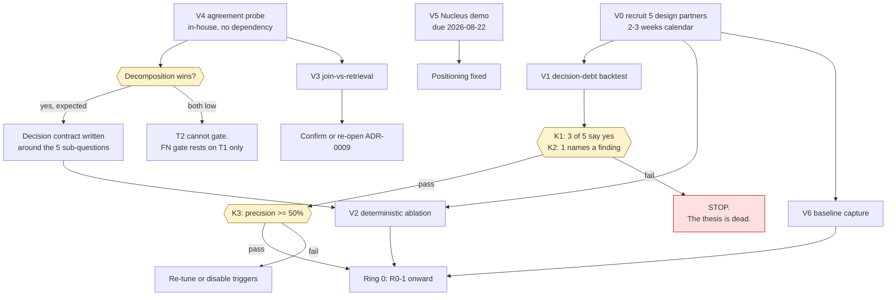

# Phase 0 — Validation Protocols

**Deliverable:** makes `mvp-backlog.md` §1 (V1–V6) runnable
**Date:** 2026-08-16
**Status:** Pre-registered. **Thresholds in this document are fixed before any data is seen** (§0.2).
**Blocks:** R0-1, and therefore everything. `mvp-backlog.md` §3: *"V1 falsification test → R0"*
**Governed by:** ADR-0010 (label integrity), `evaluation-system.md` §1 (ground-truth tiers), `risk-model.md` (the artifact V2 tests)

---

## 0. Preconditions

### 0.1 The real first task is not on the list

V1 requires *"three prospects' historical closed-finding exports."* Nothing in the backlog says how those are obtained, and they are the long pole — an AppSec director exporting a year of closed findings to a pre-product company is a trust transaction with a lead time measured in weeks, not an afternoon.

| ID | Task | Effort | Why it is here |
|---|---|---|---|
| **V0** | **Recruit 5 design partners** who will (a) hand over a closed-findings export and (b) sit for a 60-minute review of the result | **2–3 weeks calendar**, ~0.5 ew of effort | Every other item is blocked on it. Five, not three, because V1's gate is stated as *3 of 5* and because attrition between "yes, interesting" and "here is the file" is high |

**What makes the ask answerable:** the export never leaves their environment — **the partner runs the backtest, we do not.** That is the same property that makes Ring 0 installable during a pilot conversation (`mvp-backlog.md` §2.1), and it is the first sentence of the ask, not a reassurance offered after an objection. If the *validation* of a "nothing leaves your environment" architecture requires violating it, the claim was never real.

> **Hard requirement on V1 tooling that follows from this:** a **single file, standard library only, no install step**, fetching two documented public feed URLs at run time. Anything needing a virtualenv, a Docker daemon or a package index is a script that does not get run.

**Full recruitment materials — qualification, outreach copy, per-system export instructions, written data commitments, session agenda, objection handling and the tracker — are in [`design-partner-kit.md`](../product/design-partner-kit.md).**

**Acceptable export formats:** DefectDojo finding export (CSV/JSON), Jira CSV of closed security tickets, GitHub code-scanning dismissed alerts (API export), or a scanner's own suppression list. Minimum viable fields: an identifier, a CVE or rule id, a package or location, a close date, a close reason, and — ideally — who closed it.

### 0.2 Pre-registration

Every threshold in this document is committed to version control **before the first export is received**, and the commit hash is recorded in each protocol's result. A threshold moved after seeing data is not a threshold; it is a rationalization, and the entire point of a kill gate is that it can actually kill.

If a threshold must change, the change is a dated entry in §8 with its reasoning, and the original stays visible.

### 0.3 What may and may not be run without a customer

| Item | Runnable in-house? | Why |
|---|---|---|
| V4 annotation-agreement probe | **Yes** — it measures the *instrument*, not the answer | Whether decomposition raises κ is a property of the question form, not of a tenant |
| V3 join-vs-retrieval bake-off | **Partly** — on public advisories with vendor analysts | Sufficiency of an evidence bundle is largely tenant-independent |
| V2 deterministic ablation | **No** | Labels are exploitability judgments, and *"exploitable in our environment"* is tenant-specific by definition (`evaluation-system.md` §2.3, §6) |
| V1 decision-debt backtest | **No** | It is entirely about a specific organization's history |
| V6 baseline capture | **No** | It measures a customer's current process |

V4 first, then, because it is the only one with no external dependency and its result changes the shape of everything downstream.

---

## 1. V1 — Decision-debt backtest

**The company gate.** If this fails, nothing else in the roadmap matters.

### 1.1 Question

> Of the findings this organization closed in the last 12–24 months, how many acquired evidence afterwards that invalidates the reason they were closed — and would the people who closed them have wanted to know?

### 1.2 Pre-registered kill criteria

| # | Criterion | Threshold | Deadline |
|---|---|---|---|
| K1 | Partners who say the re-opens were wanted | **≥3 of 5** | 2026-09-30 |
| K2 | Partners naming a **specific finding that alarms them** | **≥1** | 2026-09-30 |
| K3 | Re-litigation precision — re-opens the analyst agrees with, on review | **≥50%** | 2026-10-31 |

**If K1 or K2 fails: stop.** Not re-scope, not re-tune — stop. The thesis is that organizations want to know, and this measures exactly that.
If K3 fails but K1/K2 pass: re-tune triggers, and disable individually any trigger below 40% precision (`evaluation-system.md` §3.3).

### 1.3 The methodological requirement everything else depends on

> **Evidence must be reconstructed as-of the decision date, not read as-of today.**

Get this wrong and the backtest is worthless in the flattering direction. Three concrete failure modes:

| Failure | What it produces |
|---|---|
| Counting a CVE as "now in KEV" without checking `dateAdded` against the close date | Findings closed *after* the KEV listing are scored as re-opens. They are not — they are an analyst who closed a KEV finding, which is a different (worse) story |
| Using today's EPSS score against a threshold | EPSS moved v4→v5 in fifteen months. A score computed under a different model is not comparable to the one that existed at decision time, and the drift alone will manufacture "crossings" |
| Using the current advisory affected-range | The narrowing/widening **is** the signal (`risk-model.md` §7.3). Reading only the current state discards the event |

**Required historical sources, and their availability:**

**Verified 2026-08-16** — see [`exp-001`](exp-001-epss-model-boundary.md). These are measured availabilities, not estimates.

| Trigger | Historical source | V1 status |
|---|---|---|
| **KEV listing** | CISA KEV carries `dateAdded` per entry; 1,665 entries back to 2021-11-03; **~24 additions/month** | ✅ **Exact.** The workhorse trigger |
| **Advisory range narrowing** | OSV/GHSA git history | ⚠️ **Partial** — reconstructible for GHSA; weak for vendor PSIRTs |
| Exploit published | Advisory references, exploit-DB dates | ⚠️ Approximate — dates are publication, not availability |
| **EPSS threshold crossing** | Daily snapshots exist back to 2023 — **but the window crosses two model boundaries** | ❌ **EXCLUDED.** See below |
| Reachability / exposure change | Customer's own history | ❌ Not in an export |
| Ownership change | Customer's own history | ❌ Not in an export |

> **Why EPSS is excluded, with the number.** `exp-001` measured the v4 → v5 boundary against a same-model control over an identical 10-day gap: **71,885 CVEs crossed the 0.01 threshold upward across the boundary versus 306 in the control — 235×**, with **0.0% of scores unchanged**. The current model epoch began ~2026-06-15, so a 12-month backtest crosses one boundary and a 24-month backtest crosses two. Re-scoring history under one model is impossible; we do not have the model. Percentile is not a workaround — it is worse.

**Consequence, and state it to partners up front:** V1 tests **one exact trigger and one partial one.** That is a floor, not a limitation — if KEV alone surfaces a finding an AppSec director calls alarming, the full set can only do better. Claiming seven triggers on data that cannot support them is how a backtest becomes a demo, and a partner who later discovers the gap will discount everything else in the report.

### 1.3.1 A second result, free, from the same pass

Building the tool surfaced something the protocol did not anticipate. Applying the as-of rule splits the population in two, and only one half is decision debt:

| | Definition | What it says |
|---|---|---|
| **Decision debt** | The CVE entered KEV **after** the close date | The thesis: the world changed under a decision |
| **Closed despite** | The CVE was **already** in KEV on the close date | Not decision debt. A finding closed while already known-exploited |

The second needs no re-litigation engine, no evidence layer and no product — only a check nobody ran. It costs one extra comparison in the same pass over the same feed.

**Report them separately and never merge them.** Merging would inflate the headline number with findings that support a different (and less flattering) story, and a partner who noticed would be right to discount everything else. Lead the session with the second one if it is non-zero: it is immediate, undeniable, and it costs us nothing to have found.

### 1.4 Method

1. **Ingest** the export. Normalize to: `{id, cve_ids[], purl?, rule_id?, repo?, closed_at, close_reason, closed_by?}`.
2. **Split by close reason.** Formal risk acceptance vs **false-positive dismissal** vs won't-fix vs mitigated. Count both piles — this is assumption **A4** in `competitive-positioning.md` §7 and it has never been measured.
3. **Exclude** findings closed before the study window and findings with no resolvable CVE/purl/rule (record the exclusion rate; a high one is itself a finding about export quality).
4. **For each finding, reconstruct the as-of evidence state** at `closed_at`, then walk forward day by day to today, emitting a trigger event the first time a condition flips. One event per finding — the first wake-up, not every subsequent movement.
5. **Compute decision debt:** the set of closed findings with ≥1 trigger event.
6. **Produce the artifact** (§1.6).
7. **Review session, 60 minutes, structured** (§1.5).

### 1.5 The review session — the part that actually decides

Do not present a number. Present findings, and ask three questions in this order, recording verbatim answers:

| # | Question | Measures |
|---|---|---|
| Q1 | *"Here are 20 findings you closed. Since then, this changed about each. Walk me through: which of these would you have wanted to know about?"* | **K1** |
| Q2 | *"Is there one here that concerns you?"* | **K2** — a yes is worth more than any aggregate |
| Q3 | *"If this had arrived as a notification the week it happened, what would you have done — and would you still have that reaction if it arrived twenty times a month?"* | The alert-fatigue failure mode, which is the way this product most plausibly dies after succeeding |

**Do not lead.** The interviewer states what changed and stops talking. "Would you have wanted to know about a KEV listing?" answers itself; the finding-by-finding walk does not.

Sample 20, stratified across triggers and close reasons — not the top 20 by severity, which would measure the sampling and not the product.

### 1.6 Output artifact

A single self-contained HTML or PDF file, generated locally, containing: counts by trigger and by close reason; the 20 reviewed findings with as-of vs now evidence side by side; the exclusion rate; **the list of triggers that could not be tested and why**; and the pre-registration commit hash.

That last item is not bureaucratic. Handing a prospect a document that says *"we decided the pass mark before we saw your data, here it is"* is a credibility move no competitor's benchmark makes.

### 1.7 Threats to validity

| Threat | Mitigation |
|---|---|
| Selection: partners who agree to export are the ones who already believe | Record it. Note it in the write-up. It cannot be fixed at n=5 |
| Hindsight: everything looks like it should have been caught | Q3 exists to counteract it, and K3 (analyst agreement on review, not on the trigger) is the real measure |
| Export quality: dismissals often lack a reason code | Report the exclusion rate as a first-class result |
| The interviewer wants a yes | Verbatim recording; if possible, someone other than the founder runs the session |

---

## 2. V2 — Deterministic-only ablation

### 2.1 Question

> How much of the decision quality is available from a hand-written policy with no model at all?

This is the floor the LLM must clear, and **`risk-model.md` is the hand-written policy** — the fifteen-row tree in §4.2, not a new artifact invented for the experiment.

### 2.2 Pre-registered criteria

| Outcome | Meaning | Action |
|---|---|---|
| Tree is within ~5 points of the analyst-adjudicated labels | The model is decoration on the decision path | **The differentiation hypothesis needs rework, not more model.** Move the LLM to `reasoning_summary` and re-plan Ring 1 |
| Tree is 5–15 points below | Expected. The model has a measurable job | Proceed; the gap is the LLM's budget justification |
| Tree is >15 points below | Either the tree is wrong or the features are unavailable | Diagnose which before concluding anything about models |

**Report per stratum, never only in aggregate.** A tree that matches analysts on SCA and fails on SAST is a specific, actionable result; a single blended number hides it.

### 2.3 Method

1. 200 findings from a partner, stratified per `evaluation-system.md` §2.3: source tool × class × severity, **including the two adversarial strata** (hard negatives that look critical; hard positives that look trivial). Without those strata the set measures the easy majority and reports a flattering number.
2. Labels: the **five sub-questions** of `evaluation-system.md` §1.3, three annotators, majority vote, κ recorded per sub-question. Labels come from the **partner's** analysts (§0.3).
3. Compute the decision points and band for each finding with the `risk-model.md` derivation rules, by hand or by script — no implementation required.
4. Compare band against the labels' derived judgment.
5. **Report feature availability separately.** If `reachability_verdict` is `unknown` for 80% of findings, the tree's performance is a statement about the customer's tooling, not about the tree.

### 2.4 The result that would be most valuable

A high `unknown` rate on DP2 `exposure` and DP4 `criticality`. It would mean the binding constraint is the **asset registry**, not the decision logic — which redirects engineering from scoring to ownership resolution, and is exactly the kind of finding worth 1 engineer-week to discover before spending twelve on the wrong layer.

---

## 3. V3 — Join-vs-retrieval bake-off

### 3.1 Question

> For a triage decision, is a deterministically assembled evidence bundle sufficient — or does semantic retrieval add something an analyst needs?

ADR-0009 already bets on deterministic slot-filling. **This experiment can refute an accepted ADR**, which is the point of running it before implementation.

### 3.2 Pre-registered criteria

| Outcome | Action |
|---|---|
| Deterministic wins or ties on sufficiency | **The RAG framing is wrong.** ADR-0009 is confirmed and the vector layer shrinks further; `R1-12` (hybrid retrieval) may drop out of Must |
| Retrieval wins materially on ≥1 slot | Keep hybrid retrieval **for those slots only**, named in the ADR |
| Retrieval wins broadly | ADR-0009 is wrong; re-open it before R1-11 |

### 3.3 Method

200 findings. For each, assemble evidence twice:

- **Bundle A — deterministic join:** CVE → advisory snapshot → affected ranges → KEV → EPSS → package coordinates → asset record → prior decisions on the same `rule_id` + `repo_id`. Pure SQL-shaped lookups.
- **Bundle B — top-k semantic retrieval** over the same corpus.

Present both to an analyst **blind and order-randomized**, and ask one question: *"Is this enough to decide? If not, what is missing?"*

The free-text "what is missing" is the more valuable output than the win rate. It is the empirical source for the evidence-slot list in ADR-0009, which is currently a design guess.

### 3.4 Note on measurement

Do **not** compute nDCG or MRR. There is no per-query relevance ground truth for this task, and the metric would be unmeasurable rather than merely inconvenient (`evaluation-system.md` §9). Sufficiency, judged by an analyst, is the measurable quantity.

---

## 4. V4 — Annotation-agreement probe

**Run this first.** It has no external dependency, it is the cheapest item, and its result changes the data model.

> **Full kit — environment brief, corpus strata, both forms verbatim, counterbalancing schedule, the pre-registered fusion rule and the analysis instrument: [`v4-annotation-kit.md`](v4-annotation-kit.md).**
>
> The kit corrects two things in the outline below. **The comparison is κ_holistic vs κ_derived** — the decision fused deterministically from each annotator's own sub-question answers — not κ_holistic vs per-sub-question κ, which compares different tasks and would favour decomposition by construction. And **the experiment requires a fixed fictional environment**: Q1, Q2 and Q4 are questions about an environment, so without one every answer is `unknown` and the probe measures nothing.

### 4.1 Question

> Do three analysts agree with each other more when asked five binary verifiable sub-questions than when asked one holistic question?

### 4.2 Pre-registered criteria

| Outcome | Action |
|---|---|
| Holistic κ < 0.5 **and** decomposed κ > 0.7 (the expected result) | **The decomposition becomes the core data model.** The decision contract is written around the five sub-questions before implementation begins |
| Both high | Holistic questions are usable; simplify the annotation protocol and save cost |
| Both low | Neither form is a reliable label source. **This is the dangerous outcome** — it means the T2 tier of `evaluation-system.md` §1.1 cannot support a gate, and the FN gate must rest entirely on T1 retroactive outcomes |
| Per-sub-question κ < 0.6 | That sub-question is a **diagnostic, never a release gate**. Publish the value |

### 4.3 Method

50 findings × 3 analysts × 2 forms. Order and form counterbalanced; a minimum 48-hour gap between an analyst seeing the same finding in the other form, so the second answer is not an echo of the first.

- **Holistic:** *"Should this be prioritized? (yes / no / needs review)"*
- **Decomposed:** Q1 reachable from an entry point · Q2 entry point externally exposed · Q3 public exploit or PoC exists · Q4 compensating control present **and enforcing** · Q5 affected range covers our version. Each binary with an explicit `unknown`.

Statistic: **Fleiss' κ** for 3 raters, reported per form and per sub-question, **with a confidence interval**.

### 4.4 Honest limit on n

At n=50 the standard error on κ is roughly 0.08–0.12. That is enough to distinguish 0.4 from 0.75 — the effect the experiment is looking for — and **not** enough to claim "κ = 0.71" as a measurement. Report the interval, always. This is a directional probe designed to pick a data model, not a published statistic.

Percent agreement is reported alongside κ, because κ is unintuitive under skewed marginals and a reviewer will ask.

---

## 5. V5 — Competitive verification

**Partially discharged 2026-08-16.** See `competitive-teardown.md` §2 round 2: Brinqa, Phoenix, Cycode, Semgrep verified; Seemplicity, Apiiro, OX unavailable from public sources.

**Remaining, and it is the whole point:** the four Nucleus questions (**T-1**, due **2026-08-22**). Documentation has been exhausted across two rounds; only a demo answers it. The question set is `competitive-teardown.md` §1.

> Escalated here because it is the one Phase 0 item where two rounds of research were spent on a question research could never answer. **Book the demo.**

---

## 6. V6 — Baseline capture instrument

### 6.1 Question

> What does triage cost this organization *today*, measured in a way that will still be valid when we measure it again in six months?

Every before/after claim the product will ever make depends on this, and it is **unrecoverable retrospectively**: an organization that installs SDIP without a baseline can never produce one.

### 6.2 The honest problem

"Analyst-hours spent on triage" is not in any system. It is estimated, and estimates of one's own time are unreliable in a known direction. So the instrument uses **two measures with different biases** and reports both, never a blend:

| Measure | Source | Bias | Use |
|---|---|---|---|
| **M1 — Median time-to-disposition** | Ticket/tool timestamps: first touch → close | **Objective.** Contaminated by queue wait, not work | The headline metric. Comparable over time because the contamination is stable |
| **M2 — Analyst-hours per 1,000 findings** | 2-week time diary, per analyst, per finding class | Self-reported, typically under-reported | The ROI conversation. Always with its collection method attached |

**M1 is the metric to sell on**, because the customer can recompute it themselves from their own system without trusting us.

### 6.3 Method

1. **Window:** 2 consecutive weeks, avoiding a release freeze, a quarter end, and any month with a KEV-driven fire drill. Record what was happening; a baseline captured during a Log4Shell week is not a baseline.
2. **M1:** export tickets closed in the trailing 90 days; compute median and p90 time-to-disposition, segmented by finding class and severity. Report **median, not mean** — the distribution has a long tail and the mean describes the tail.
3. **M2:** a diary with one line per triage session: finding id, minutes, outcome. Not a timesheet.
4. **Also capture, because they are needed later and are equally unrecoverable:** findings ingested per week; the ratio of closed-as-FP to closed-as-fixed; the number of analysts touching the queue; the **ownership resolution rate** (fraction of findings where the owner is known without asking someone).
5. **Compute the audit-cost offset now, not later.** `evaluation-system.md` §3.2 requires ~600 audits × ~4 min ≈ 40 analyst-hours per window once auto-suppression is enabled. It is subtracted from any savings claim: *"160 hours net of audit"* is the honest form and a more credible sentence than *"200 hours saved."*

### 6.4 V6 and shadow mode are one instrument

`ADR-0010` §5 requires 30 days of shadow mode per tenant at onboarding: the system decides, analysts decide independently, the system's answer is hidden until the analyst submits. **That is the same measurement taken later**, and it produces the unbiased calibration set as a by-product.

Build V6 as the pre-install half of one instrument, with the same fields and the same definitions, or the before and after will not be comparable and the whole exercise produces two unrelated numbers.

---

## 7. Sequencing

| Week | Work | Gate at the end |
|---|---|---|
| **Now** | **V5 Nucleus demo** (due 2026-08-22) · **V0 partner recruitment starts** | Positioning fixed |
| 1 | V4 (in-house, no dependency) | Decision-contract shape decided |
| 1–3 | V0 continues · V3 on public data | ADR-0009 confirmed or re-opened |
| 3–5 | V1 on the first exports · V6 with the first partner | — |
| 5–6 | V2 once labels exist | — |
| **6** | Review all | **V1 kill gate: K1 + K2. Stop or proceed to R0-1** |

Total effort ≈ **5.2 ew** including V0, against the backlog's 4.7 ew, which omitted recruitment. Calendar is ~6 weeks and is dominated by V0, not by analysis.

---

## 8. Threshold-change log

Empty by design. Any change to a pre-registered threshold in §1–§6 is appended here with date, reasoning and the person who approved it. **The original threshold is never edited out.**

| Date | Threshold | From | To | Reason | Approved by |
|---|---|---|---|---|---|
| — | — | — | — | — | — |

---

## 9. What Phase 0 cannot tell us

Stated so the results are not over-read at the gate:

- **Whether they will pay.** V1 measures whether they want to know. Willingness to pay is a separate test with a separate deadline (`mvp-backlog.md` §4: ≥2 partners at ≥$30k by 2026-12-31).
- **Whether re-litigation precision holds at production volume.** V1's backtest is retrospective, batch, and hand-reviewed. A live trigger stream at 20 re-opens a week is a different product experience, and it is the failure mode Q3 probes but cannot measure.
- **Whether the FP pile is genuinely larger than the risk-acceptance pile** across the market. n=5 measures five organizations. It is enough to proceed and not enough to put in a deck.
- **Anything about scale, cost or latency.** Nothing here touches an LLM. That is deliberate: **not one of these six experiments requires a model to run**, and if the company's core thesis cannot be tested without inference, it was never the thesis.
