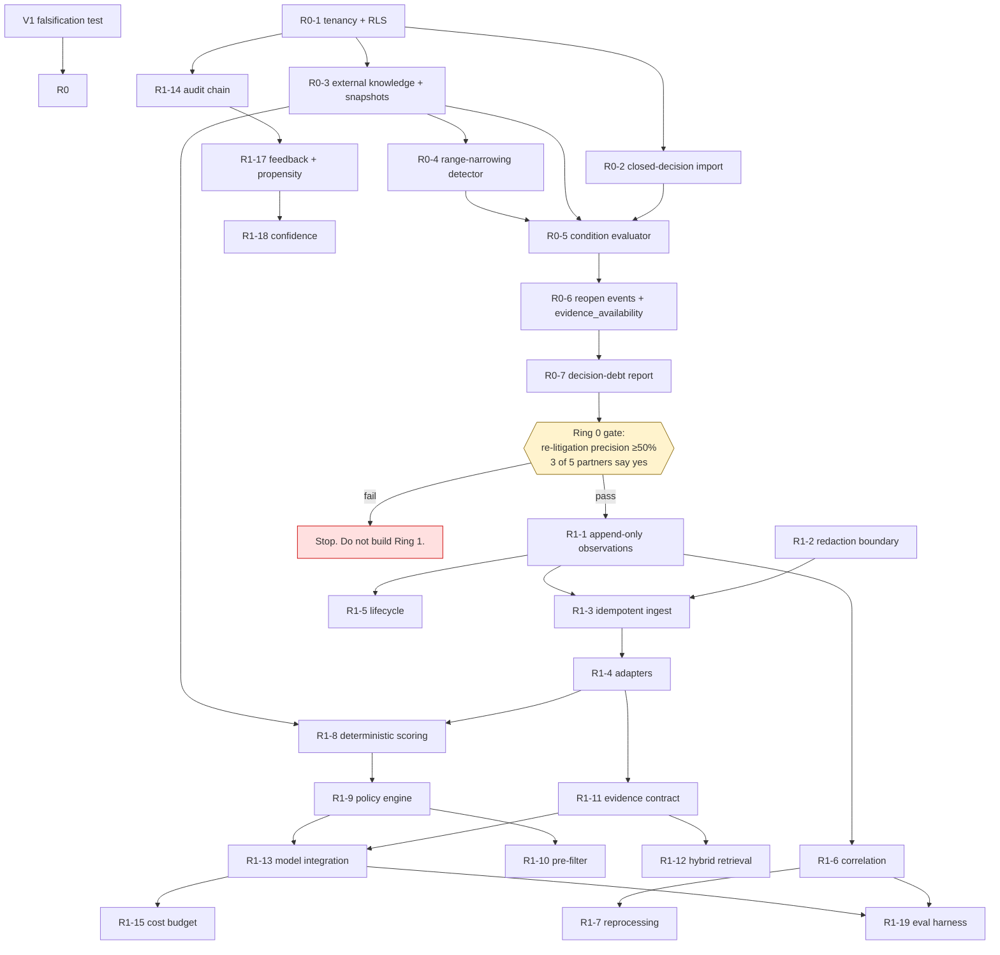

# MVP Backlog — SDIP

**Deliverable:** CLAUDE.md §46.I
**Date:** 2026-08-15
**Status:** Plan. Ordered by dependency, classified by MoSCoW, sized in engineer-weeks.
**Sizing assumption:** one senior engineer-week includes implementation, tests, migration and docs. It excludes design, which is what the ADRs are. Team assumed at **3 engineers**.

---

## 0. The structural insight that shapes this backlog

The positioning work produced a conclusion that changes the build order, and it is worth stating before the tables:

> **The hero demo requires no LLM, no scanner integration, and no correlation engine.**

"Of the 3,412 findings you closed last year, 46 are now on CISA KEV, 12 became internet-reachable, and 7 had their advisory's affected range narrowed after you dismissed them" is produced by: importing closed decisions from a system the customer already has, enriching them from free public feeds, and diffing. That is SQL and cron.

So the backlog is two rings, not one list:

| Ring | What it is | Effort | Proves |
|---|---|---|---|
| **Ring 0 — the analyzer** | Import existing closed decisions → enrich → detect deltas → report. Runs locally, sends nothing anywhere | **~14 ew** | The thesis. Sellable, demoable, and falsifiable |
| **Ring 1 — the platform** | Own ingestion, correlation, evidence assembly, model-assisted decisions | **~62 ew** | That it works at scale on findings we ingest ourselves |

Ring 0 first is not a phasing convenience. It is the only sequence in which the company learns whether the thesis is true **before** spending six months on the platform — and it is the only sequence that routes around the enterprise security review that kills seed-stage security vendors, because nothing leaves the customer's environment.

**If Ring 0's falsification test fails, Ring 1 should never be built.**

---

## 1. Phase 0 — validation, before any product code

None of this is product code. All of it can invalidate the plan.

> **Protocols, pre-registered thresholds and sequencing: [`docs/evaluation/phase-0-protocols.md`](../evaluation/phase-0-protocols.md).**
> That document adds **V0**, which this table was missing, and which is the actual long pole.

| # | Item | Effort | Kills |
|---|---|---|---|
| **V0** | **Recruit 5 design partners** willing to hand over a closed-findings export and sit for a 60-minute review. **2–3 weeks calendar.** Every item below is blocked on it, and V1's gate is stated as *3 of 5* | 0.5 ew | Nothing directly — **blocks everything** |
| V1 | **Decision-debt backtest.** Three prospects' historical closed-finding exports; compute what would have re-opened in 12 months; ask an AppSec director "would you have wanted to know?" **Realistically tests 2–3 triggers, not 7** — see the as-of reconstruction requirement in the protocol | 1 ew | **The company thesis** |
| V2 | **Deterministic-only ablation.** 200 findings scored by a hand-written policy (CVSS × KEV × EPSS × reachability × criticality) vs analyst labels | 1 ew | The differentiation hypothesis, if a spreadsheet gets within a few points |
| V3 | **Join-vs-retrieval bake-off.** 200 findings, evidence assembled deterministically vs semantically; analysts judge sufficiency | 1 ew | The RAG framing (ADR-0009) |
| V4 | **Annotation-agreement probe.** 3 analysts × 50 findings, holistic vs decomposed sub-questions; measure κ | 0.5 ew | The decision contract's shape |
| V5 | **Competitive verification.** The four Nucleus questions; re-check Brinqa, Seemplicity, Phoenix, Cycode, Apiiro, OX exception docs | 0.2 ew | The positioning (D1), if re-litigation turns out occupied |
| V6 | **Baseline capture instrument.** A method for measuring a customer's pre-install triage hours and median triage time | 1 ew | Every before/after claim, which is currently unprovable |

**Total: ~5.2 ew including V0** (the original 4.7 omitted recruitment). Calendar is ~6 weeks and is dominated by V0, not by analysis.

Two corrections from the protocol work:

- **V5 is no longer 8 hours of research.** Documentation was exhausted across two teardown rounds (`competitive-teardown.md` §2); the remaining question — the four Nucleus questions — is only answerable in a demo. **Book it; do not search again.**
- **V4 should run first**, not V5. It is the only item with no external dependency, and its result decides the shape of the decision contract before anything is built around it.

---

## 2. MoSCoW

### 2.1 MUST — Ring 0 (the analyzer)

| # | Item | Effort | Depends on | ADR |
|---|---|---|---|---|
| R0-1 | Migration #1: roles, `org_id` composite keys, RLS + FORCE, enum types, **migration gate in CI** | 2 | — | 0003 |
| R0-2 | Closed-decision import: DefectDojo export, Jira CSV, GitHub dismissals → canonical `decision` + `suppression` records marked `source_system` | 3 | R0-1 | 0016 |
| R0-3 | External knowledge: CISA KEV, EPSS (model-version pinned), OSV/GHSA — with **snapshots, content hashes and authority tiers** | 3 | R0-1 | 0013 |
| R0-4 | **Advisory range-narrowing detector** — diff affected ranges between snapshots | 1 | R0-3 | 0013 |
| R0-5 | Invalidation-condition evaluator (watch-worker): KEV listed, EPSS threshold, exploit published, range narrowed, calendar | 2 | R0-3, R0-4 | 0016 |
| R0-6 | `reopen_event` + `evidence_availability` reconstruction ("what was knowable then") | 2 | R0-3, R0-5 | 0012 |
| R0-7 | **Decision-debt report**: `GET /v1/decision-debt`, grouped by trigger, plus a static export artifact | 1 | R0-6 | — |
| **Total** | | **14** | | |

Ring 0 has **no model, no scanner adapter, no correlation, no vector store, and no repo credential.** That is what makes it 14 weeks instead of 60, and what makes it installable during a pilot conversation instead of after a security review.

### 2.2 MUST — Ring 1 (the platform)

| # | Item | Effort | Depends on | ADR |
|---|---|---|---|---|
| R1-1 | Append-only observations, `scan_run`, versioned identity, `observation_fingerprint` | 3 | R0-1 | 0001 |
| R1-2 | **Redaction boundary**: `RawScannerPayload` type, MyPy strict gate, canary harness | 2 | — | 0011 |
| R1-3 | Idempotent ingest API: streaming parse, hard caps, per-field truncation-as-evidence, poison-record DLQ, per-tenant quotas | 2.5 | R1-1, R1-2 | 0005 |
| R1-4 | Adapters: SARIF 2.1.0 (Semgrep, CodeQL) + Trivy native JSON, incl. structural `codeFlows` and per-source CVSS triples | 3 | R1-3 | 0004 |
| R1-5 | Finding lifecycle state machine, `scope_hash`, N-scan absence rule | 2 | R1-1 | 0002 |
| R1-6 | Correlation tiers 0–2, blocking with hard cap, append-only edges, versioned materialization | 4 | R1-1 | 0006 |
| R1-7 | Reprocessing orchestration: progress, resumability, shadow output, promotion | 2.5 | R1-6 | 0006 |
| R1-8 | Deterministic risk scoring: versioned feature vector + score | 2 | R1-4, R0-3 | — |
| R1-9 | **Policy engine**: versioned, unit-tested, owns every decision; guardrails; non-suppressible path | 3 | R1-8 | 0007 |
| R1-10 | **Deterministic pre-filter** + materiality gate | 2 | R1-8, R1-9 | 0008 |
| R1-11 | Evidence contract: typed slots, `evidence_gap`, drop log, ~20 deterministic conflict rules | 3 | R0-3, R1-4 | 0009 |
| R1-12 | Hybrid retrieval for the two free-text slots: pgvector + FTS + RRF, `as_of` enforced in query | 2 | R1-11 | 0009, 0014 |
| R1-13 | Model integration: one provider, structured output, grounding validation, refusal fail-closed, **differential decisioning on the suppression path** | 3 | R1-11 | 0007, 0015 |
| R1-14 | Decision record + audit hash chain + `audit_chain_tip` serialization + external anchoring + WORM export | 3 | R0-1 | 0012 |
| R1-15 | Cost budget: pre-call estimation, queue-don't-spend, degraded mode, usage ledger | 2 | R1-13 | 0008 |
| R1-16 | Ownership resolution: CODEOWNERS + manual override + confidence | 2 | R1-1 | — |
| R1-17 | Feedback: revisions (append-only), **randomized audit sampling with `review_propensity`**, retroactive label job | 3 | R1-14 | 0010 |
| R1-18 | Confidence: evidence-completeness score, calibration store, **empirical agreement bands in the UI** | 2.5 | R1-17 | 0010 |
| R1-19 | Evaluation harness + GS-CORR, GS-IDENT, GS-DEC, GS-FN, GS-INJ, GS-ISO | 5 | R1-6, R1-13 | — |
| R1-20 | API surface + contract tests (incl. the eight in `docs/api/README.md` §9) | 3 | most | — |
| R1-21 | Auth: OIDC, roles, step-up for suppression, ingest-token minting, credential inventory | 2.5 | R0-1 | 0011 |
| R1-22 | Observability: cost per decision, LLM touch rate, queue depth, refusal rate, per-tenant vector recall | 2 | R1-13 | — |
| R1-23 | UI: finding list, decision detail, decision-debt view, reopen queue, evidence panel with gaps and drops | 5 | R1-20 | — |
| **Total** | | **62** | | |

**Ring 0 + Ring 1 = ~76 ew ≈ 25 calendar weeks at 3 engineers ≈ 6 months**, before contingency. State that number honestly in any plan; the common failure is presenting the same scope as "3 months."

### 2.3 SHOULD — valuable, deferrable past first revenue

| # | Item | Effort | Why not Must |
|---|---|---|---|
| S1 | Snyk + Gitleaks adapters | 2 | Gitleaks is explicitly deferred until the redaction boundary is proven in production (ADR-0011) |
| S2 | Jira / GitHub write-back | 2 | Buyers live there, but read-only proves the thesis first |
| S3 | Policy / SLA engine with breach detection | 2.5 | Top-three deal-closing capability, cheap to add, not needed to prove value |
| S4 | Dependency closure materialization | 2 | Only needed once transitive reachability questions appear |
| S5 | Continuous decision-log export to customer-controlled storage | 2 | Enterprise differentiator; design the format now, ship on demand |
| S6 | Per-tenant evaluation harness as a product feature | 3 | Genuinely differentiating; needs a customer to co-design with |
| S7 | Shadow-mode onboarding (30 days) | 1.5 | Required before auto-suppression is enabled for anyone |
| S8 | Conformal risk control on the auto-deprioritize gate | 2 | Needs ~1,000 calibration examples that do not exist yet |

### 2.4 COULD — only with a customer pulling

| # | Item | Effort |
|---|---|---|
| C1 | Additional scanner adapters (Checkov, SonarQube, Dependabot) | 1.5 each |
| C2 | Slack notifications for reopen events | 1 |
| C3 | Tier-3 LSH/MinHash correlation for vendored copies | 3 |
| C4 | Cross-encoder reranker in the decision path | 2 |
| C5 | `knowledge/search` endpoint | 2 |
| C6 | Database-per-tenant enterprise tier | 4 |

### 2.5 WON'T — for MVP, with the trigger that would change it

| Item | Why not | Trigger |
|---|---|---|
| **Reachability analysis** | Endor raised $93M for this exact problem; scanner-layer reachability already cuts SCA volume ~92%. **Consume it as evidence; never compete** | Never |
| **Autofix / PR generation** | Five better-funded vendors ship it; GitHub bundles it | Never |
| **Remediation workflow engine** | Jira exists; incumbents own the surface | Never |
| **Pattern Discovery (§17)** | Statistical power does not exist for 6–12 months per tenant. A materialized view with an explicit `n` is the whole feature | ~20 customers |
| **Learning Engine as a subsystem (§15)** | At MVP it is an append-only revision table plus a nightly aggregate | Measurement justifies it |
| **NLI contradiction model** | ~20 deterministic rules cover the majority at zero cost; 30–40% false contradictions would flood `needs_review` | Rule-table recall measured inadequate **and** ≥300 labelled conflict pairs |
| **Multi-agent / critic pipeline (§14)** | Must beat both the single-model baseline **and** the deterministic-only ablation | Measured improvement on the frozen set |
| **Multi-provider LLM abstraction (§13)** | Sampling params, logprobs, refusals and retention terms are not abstractable. **Still true — ADR-0018 does not contradict it** | ~~Never as briefed; one adapter, one fallback~~ → **FIRED 2026-08-24, for a different reason.** See below |
| **Graph database** | One polymorphic edge table + one precomputed closure covers the known query set | A measured ≥4-hop pattern Postgres cannot serve |
| **Fine-tuning / custom embeddings** | No data; would fossilize the cold-start problem into weights | ≥50,000 labelled decisions |
| **Kafka, Kubernetes, multi-region HA** | Redis-backed workers on one Postgres are sufficient at this scale | Demonstrated need, not aesthetics |
| **Attack-path analysis, automated pentesting, autonomous remediation** | Each adds a false-negative surface the evaluation system cannot yet measure | Post-MVP, after the FN ceiling is measurable |
| **Automatic suppression without human review** | This is where the entire liability exposure lives | Per-tenant opt-in after §3 gates pass |
| **Repo-read credentials** | An org-wide source-code exfiltration capability held by a Series-A startup | Customer demands pull, with a scoped GitHub App |
| **Category creation for "Security Decision Intelligence"** | No analyst-relations budget, no category | Never at this stage |

### 2.5.1 Triggers that fired

A rejected item silently reversed is worse than one never written down. The original
wording above stays visible; this is what changed and why.

| Date | Item | What fired it |
|---|---|---|
| 2026-08-24 | **Multi-provider LLM abstraction** | Not the trigger anyone expected, because it is **not the same decision**. The WON'T rejected *vendor optionality* — six adapters to smooth a procurement conversation, bought with a month of engineering and an abstraction that leaks on five axes. What fired is *egress topology*: the product became a desktop application, so the question "does this data leave the machine" moved from us, once, to the user, per analysis. One local runtime plus one cloud vendor are not two interchangeable suppliers; they are two answers to that question. **Capped at three adapters and enforced by a test**, so the next one is a new decision rather than an increment. Every reason the original gave remains true, and the adapters do not pretend the providers are equivalent. See [ADR-0018](../adr/0018-local-first-provider-selection.md) |

---

## 3. Dependency graph

**Three items are on the critical path for reasons that are not obvious:**

- **R0-1 before everything.** Retrofitting tenancy is ~4 engineer-months plus an unbounded security review, versus 2 weeks now.
- **R1-1 before any finding is stored.** The append-only decision is the only irreversible one in the system; a mutable model makes the product's core claim permanently unbuildable for all data collected before the fix.
- **R1-17's `review_propensity` from the first decision written.** It is one column, it costs an afternoon, and it is strictly impossible to backfill. Every organizational statistic depends on it.

---

## 4. Sequencing and gates

| Window | Work | Gate at the end |
|---|---|---|
| Weeks 1–2 | Phase 0 validation (V1–V6) | **V1 kill gate**: ≥3 of 5 partners say the re-opens were wanted, ≥1 names a specific alarming finding |
| Weeks 3–7 | R0-1 … R0-4 | Migration gate green; snapshots and version pins verified |
| Weeks 8–12 | R0-5 … R0-7 | **Ring 0 gate**: re-litigation precision ≥50% on partner data |
| Weeks 13–20 | R1-1 … R1-7 (ingestion, lifecycle, correlation) | G4 identity churn ≤2%; G5 over-merge ≤1%; G6 correlation quality |
| Weeks 21–28 | R1-8 … R1-15 (scoring, policy, evidence, model, cost) | **G1 zero FN, G2 zero injection suppression, G11 cost, G12 touch rate ≤20%** |
| Weeks 29–33 | R1-16 … R1-23 (ownership, feedback, eval, API, UI) | Full gate suite; contract tests; canary tests green in production |

**Pre-registered kill criteria** (from the product review, dated so they cannot drift):

| Date | Criterion | If missed |
|---|---|---|
| 2026-08-22 | Nucleus verification complete (V5) | Re-scope the positioning to O2/O3/O4 |
| 2026-09-30 | ≥3 of 5 design partners confirm the decision-debt report contained findings they wanted | **Stop** |
| 2026-10-31 | Re-litigation precision ≥50% on partner historical data | **Stop or re-tune triggers** |
| 2026-12-31 | ≥2 partners converted to paid at ≥$30k | **Stop** |
| 2026-12-31 | Inference COGS ≤$750/customer/month at 10k findings | **Redesign** |

---

## 5. What this backlog deliberately does not contain

Roughly 60–70% of the surface implied by CLAUDE.md is absent here, and the absence is the point:

- **Six of the eight steps in the §2 product thesis are free or commodity.** Ingestion, normalization, dedup, enrichment, evidence ranking and dashboards are available from DefectDojo and free feeds. They appear in Ring 1 only because owning them is necessary to *operate* — never because they differentiate.
- **The §5 MVP wedge is narrowed** from "ingestion + normalization + dedup + prioritization + triage" to **"import existing findings *and existing decisions* → compute decision debt → re-litigate on evidence change."** Ingestion is a means, not the wedge.
- **The §36 Phase 3 list is deleted for now.** Full multi-tenancy, HA, graph-native retrieval, Kubernetes and large-scale event architecture, written before a single paying customer, is how the eighteen months get spent. Reinstate when someone pays $500k.

---

## 6. Team shape

| Role | Count | Focus |
|---|---|---|
| Backend / data | 2 | Rings 0 and 1, Postgres, workers |
| Full-stack | 1 | API, UI, integrations |
| Founder / AppSec | 1 (non-eng time) | Design partners, annotation, evaluation labels, competitive teardown |

**One thing to resist:** hiring an ML engineer before R1-13. Nothing in Ring 0 and little in Ring 1 is machine learning; the load-bearing work is data modelling, deterministic rules, and evaluation. An ML hire made early will build the parts the backlog says not to build.
