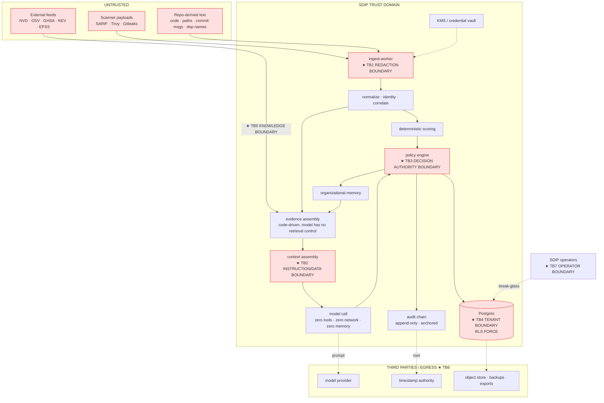

# Threat Model — SDIP

**Deliverable:** CLAUDE.md §43 · §42 (`docs/threat-model/`)
**Date:** 2026-08-16
**Status:** Living artifact. Reviewed per release on the decision path, quarterly overall.
**Method:** assets → actors → trust boundaries → STRIDE per boundary → LLM Top 10 2026 mapping → abuse cases → ranked register with owners → controls mapped to ASVS 5.0.0 → residual risk → cadence
**Source:** `critique-security.md` (all sections); ADR-0003, 0007, 0009, 0011, 0012, 0013, 0016, 0017
**Replaces:** the thirteen-item word list in CLAUDE.md §43

---

## 0. Scope and framing

SDIP is not a dashboard over security data. **Its output is a security control decision — most consequentially, a decision not to act on a vulnerability.** That single property determines everything below:

- A false negative here is not a missed alert. It is an attacker-influenced, evidence-cited, analyst-signed record stating that a real vulnerability is not real.
- The system holds a deduplicated, prioritized, cross-scanner map of a customer's exploitable surface. **It is a better attacker artifact than the raw scanner output it was built from.**
- Secret-scanner findings *contain the secrets they found*.
- An LLM sits inside the trust path of a control, and every field reaching it is attacker-influenceable.

The design posture, quoted verbatim from the OWASP GenAI project and adopted as policy:

> *"Stop trying to build a model that cannot be fooled. Build the system around it, so that when the model is fooled, and it will be, nothing important breaks."*

**In scope:** the SDIP application, its data stores, its workers, its ingestion surface, its model-provider relationship, its operators, and its evaluation assets.
**Out of scope:** the customer's own scanners, CI systems and repositories, except where SDIP's design changes their risk (which it does — see TB1 and §9 residual risk R-3).

### 0.1 Pinned standard versions

CLAUDE.md §18 requires pinning the exact ASVS version and has never done so. Pinned here:

| Standard | Version | Date | Use |
|---|---|---|---|
| **OWASP ASVS** | **5.0.0** | 2025-05-30 | Application verification baseline (§8) |
| **OWASP Top 10 for LLM Applications** | **2026, v1.0** | 2026-08 | Mandatory second baseline — ASVS 5.0.0 does not cover prompt injection (§6) |
| MITRE ATT&CK | v19.2 | 2026-08-06 | Cited only where used as evidence |
| EPSS | **v5 — feed string `v2026.06.15`** | publishing since 2026-06-15 | Pin the **model-version string the feed emits**, not the marketing version. Verified against daily snapshots in [`exp-001`](../evaluation/exp-001-epss-model-boundary.md). Prior epochs: `v2025.03.14` (v4), `v2023.03.01` (v3) |
| CISA KEV | continuous | — | Authority tier A |
| **EU CRA Art. 14** | applicable **2026-09-11** | — | Reporting-clock obligations (§5, TH-31) |

> **Verification item — CLOSED 2026-08-16.** The ASVS structure was verified against the standard's own machine-readable export (345 requirements, 17 chapters, 81 sections), and requirement-level IDs are now assigned in **[`asvs-verification.md`](asvs-verification.md)**. The chapter-level map in §8 remains as the orientation view; **the binding mapping, the target level (L2 + 16 named L3 requirements) and the verification method are in that document.** Note for anyone reading an inherited 4.0.3 mapping: 4.0.3's V5 was split into 5.0's V1 and V2, so old mappings must be re-derived rather than translated.

---

## 1. Assets

Ranked by what an attacker gains, which is not the same as ranked by what is easiest to protect.

| # | Asset | Where it lives | Compromise means |
|---|---|---|---|
| **A1** | **The decision authority itself** — the ability to make a real finding read as not-real | `policy engine`, `decision`, `memory_entry` | A durable, org-wide, self-sustaining suppression of a vulnerability class. **The highest-value target in the system** |
| **A2** | Secrets from secret-scanner findings | `observation.secret_ref`, raw payload store, DLQ, logs | Direct credential compromise of customer systems |
| **A3** | The consolidated finding corpus | `observation`, `finding_state`, exports, backups | A prioritized map of the customer's exploitable surface |
| **A4** | Decision and audit history | `decision`, `audit_record` | Repudiation, liability manipulation, and the destruction of the product's core claim |
| **A5** | Organizational memory | `memory_entry`, `rule_disposition_stats` | Poisoning that persists after the injection vector is gone |
| **A6** | Tenant isolation | RLS, cache keys, vector index, statistics | Cross-customer disclosure — the single fastest company-ending event |
| **A7** | Evaluation datasets and gates | `eval/datasets`, `eval/gates` | Shifting the quality gate itself, permanently and invisibly |
| **A8** | Integration credentials (post-MVP) | KMS | Lateral movement into every connected repo |
| **A9** | Model-provider relationship | prompts in flight, provider-side retention | Exfiltration of A2/A3 through a third party |
| **A10** | Spend | `cost_budget`, provider billing | Denial of wallet; margin destruction |

**A1 above A2 is deliberate and is the ordering this whole document follows.** A leaked secret is rotated in an afternoon. A poisoned suppression that cites its own prior decision survives the rotation, the incident review, and the vendor change.

---

## 2. Actors

| # | Actor | Capability | Motivation |
|---|---|---|---|
| **P1** | **External contributor / package publisher** | Controls text in code, paths, commit messages, dependency names and descriptions, advisory free text | Land a backdoor and have SDIP clear it |
| **P2** | Advisory-ecosystem participant | Edits community-editable advisory content (OSV, GHSA); files disputes | Suppress a class of findings; or mass-escalate to bury a real one |
| **P3** | Unauthenticated internet attacker | Reaches the API surface | Access, DoS, denial of wallet |
| **P4** | Authenticated tenant user, low privilege (`viewer`/`ci`) | Valid token, one org | Privilege escalation, cross-tenant reach |
| **P5** | **Malicious or coerced analyst/approver** | Mass-suppression capability by design | Hide findings; sabotage; exfiltrate the corpus |
| **P6** | **SDIP operator / support engineer** | Break-glass, backups, production access | **The most likely real-world cross-tenant path**, malicious or not |
| **P7** | Compromised CI system | Valid ingest token for one project | Poison ingestion; flood; forge scan history |
| **P8** | Model provider (compromise, insider, subpoena) | Sees every prompt | Read A2/A3; alter recommendations |
| **P9** | SDIP supply chain (dependency, base image, build) | Code execution in SDIP | Everything |
| **P10** | Legal adversary in a post-incident dispute | Discovery, deposition | Establish that SDIP's records are unreliable |

P5, P6 and P10 are absent from CLAUDE.md §43 entirely, and P10 is the one that determines whether the audit design in ADR-0012 was worth building.

---

## 3. Trust boundaries

| ID | Boundary | The one thing it exists to stop |
|---|---|---|
| **TB1** | Redaction boundary (`ingest-worker`) | A secret becoming permanent, embedded, prompted or logged |
| **TB2** | Instruction/data boundary (context assembly) | Untrusted text acquiring instruction authority |
| **TB3** | Decision authority boundary (policy engine) | A model opinion acquiring the power to suppress |
| **TB4** | Tenant boundary (Postgres, cache, vector, stats) | Org A's data, or an inference about it, reaching org B |
| **TB5** | External knowledge boundary (feeds → evidence) | Poisoned or silently-mutated public data becoming evidence |
| **TB6** | Egress boundary (provider, object store, exports) | A2/A3 leaving under someone else's retention policy |
| **TB7** | Operator boundary (SDIP staff) | Support access becoming an unlogged cross-tenant read |

TB1, TB2 and TB3 carry most of the risk and **none of them appear in CLAUDE.md §43.**

---

## 4. STRIDE per boundary

Threat IDs are stable and referenced from the register in §7.

### TB1 — Redaction boundary

| STRIDE | ID | Threat | Primary control |
|---|---|---|---|
| S | TH-01 | Forged scan submission with a stolen/over-scoped ingest token creates fake scan history, driving `not_present` transitions on real findings | Per-project, per-purpose, short-lived minted tokens; `ci` scope may only `POST /v1/scan-runs`; **absence requires N comparable *complete* runs** (I4) so a single forged run cannot close anything |
| T | TH-02 | Malformed/adversarial SARIF exploits the parser (zip bomb, billion laughs, deep nesting, path traversal in `artifactLocation`) | Streaming parse, hard caps, per-field truncation-as-evidence, poison-record DLQ (ADR-0005); **parsers are fuzzed as untrusted-input parsers** |
| R | TH-03 | Customer disputes that a scan was ever submitted | `scan_run` row created *before* parsing, idempotency key retained 30d, audit record chained |
| **I** | **TH-04** | **A secret in a Gitleaks/TruffleHog finding lands in the canonical model, embeddings, prompts, logs, DLQ, backups and exports** | **Type-enforced redaction: `RawScannerPayload` is non-serializable and cannot cross the boundary; MyPy strict with no exemptions in `infrastructure/redaction/`; `SecretRef` is HMAC-SHA256 under a tenant key, never a bare digest; canary harness in CI and in production** |
| I | TH-05 | Raw payload store becomes a long-lived secret repository | 30-day lifecycle, referenced by hash only, never embedded, never prompted, encrypted at rest |
| D | TH-06 | Ingestion flood exhausts workers/storage | Per-tenant quotas, admission control, hard caps, 413 above ceiling |
| E | TH-07 | `ci` token used against non-ingest endpoints | Scope check at the router; contract test |

**TH-04 is the reason Gitleaks is deferred out of the MVP** (backlog S1) despite CLAUDE.md §5 listing it. A *verified* secret is never a triage question — the answer is always "rotate now" — so it contributes near-zero decision value while importing the entire secret-handling surface. It ships after the boundary is proven in production, as a differentiated capability.

### TB2 — Instruction/data boundary

| STRIDE | ID | Threat | Primary control |
|---|---|---|---|
| **T** | **TH-08** | **Prompt injection in any ingested field steers the recommendation toward suppression** | Provenance-typed context: T0 platform instructions are static and version-hashed and **never assembled from the database**; T3 (anything whose bytes originated outside SDIP) is a length-capped data-only block with no instruction authority |
| T | TH-09 | **Evidence mimicry** — payload written to be indistinguishable from the evidence corpus | Not solvable by detection. Contained by TB3: the model cannot emit a suppressive decision at all |
| T | TH-10 | Citation fabrication — plausible `evidence_id`s not in the supplied set | Hard validation against the retrieved set; a single bad id **rejects the entire response** and fails closed to `needs_review` (I12) |
| I | TH-11 | System-prompt / hidden-context extraction (LLM08:2026) | Static, hashed, non-secret system prompt: nothing in it is confidential, so extraction is not a loss |
| I | TH-12 | Markdown/HTML/ANSI exfiltration in `reasoning_summary` — `` is zero-click | Output treated as untrusted: allowlist Markdown, **remote image loading disabled**, links interstitialed, ANSI stripped before any log or terminal sink |
| D | TH-13 | Context flooding to force truncation of the decisive evidence | Slot-based assembly with per-slot caps; **every drop is logged** (`evidence_drop`), so "was the decisive evidence dropped?" is answerable |
| E | TH-14 | Injected text requests tool use, retrieval, or memory writes | **Zero agency at decision time.** No tools, no network, no filesystem, no memory writes. Retrieval completes in code before the call |

**Detection is not the control.** Adaptive attacks bypass state-of-the-art injection detectors at >85%. SDIP therefore runs a detector and records its verdict **as evidence** (`suspected_injection`), which forces `needs_review` and flags the artifact — never as a silent filter. Stripping would destroy the audit trail, teach the attacker what evades, and hide an active attack on the customer's supply chain that the customer is paying us to find.

### TB3 — Decision authority boundary

| STRIDE | ID | Threat | Primary control |
|---|---|---|---|
| **T** | **TH-15** | **Model output becomes the decision of record** | ADR-0007 field ownership: model emits `model_recommendation` only; policy engine emits `decision`; `contextual_risk_score` and `confidence` removed from the model schema entirely |
| T | TH-16 | Suppressive outcome reached without independent grounds | **Suppressive outcomes require a deterministic predicate that holds independently of the model.** Escalation may be model-driven; suppression may not |
| T | TH-17 | Model-proposed `accepted_risk` | Removed from the model's enum. Accepting risk is a human authority act with liability attached |
| T | TH-18 | Score deviation smuggled past review | Grounding validation: `|model score − deterministic score| > δ` with no contradicting evidence cited ⇒ fail closed |
| R | TH-19 | "The system decided that, not us" / "we never said that" | Immutable `decision` + hash chain + `evidence_availability` + named approver; revisions append (I9) |
| E | TH-20 | Gradual authority creep — a later feature lets the model write a state | Structural: `REVOKE UPDATE, DELETE ON decision`; policy predicates are the only writer of `disposition`; a test asserts no policy predicate references `ordering_score` (risk-model §5.2) |

> **The asymmetry, stated once:** an attacker can always make us do more work and can never make us do less. Every other control on this boundary is defence in depth around that sentence.

### TB4 — Tenant boundary

| STRIDE | ID | Threat | Primary control |
|---|---|---|---|
| **I** | **TH-21** | Missing `WHERE org_id` in one of hundreds of queries | Composite PKs `(org_id, id)` make a cross-tenant FK **inexpressible**; RLS + **FORCE** on every tenant-scoped table; app role is not the owner; migration gate fails CI if any `org_id` table lacks RLS/FORCE |
| I | TH-22 | `SET` instead of `SET LOCAL` leaks tenant context across a PgBouncer-pooled connection | `SET LOCAL` inside an explicit transaction, through one session factory; **statement-mode pooling rejected in configuration review**; a test asserts unset context returns zero rows, not an error |
| I | TH-23 | Cache key collision: `evidence:cve-2024-1234` shared across tenants | Single Redis wrapper enforcing `t:{org_id}:` prefixes; Ruff rule banning raw `redis` imports outside it |
| **I** | **TH-24** | **Cross-tenant inference without cross-tenant reads** — cache-hit timing as an oracle; aggregate statistics that leak membership | Shared cache only for wholly public data; tenant-derived prefixes elsewhere; k-anonymity thresholds on any aggregate (**ADR-0017 is Proposed — see §9 R-5**) |
| I | TH-25 | ANN recall collapse under a shared HNSW index silently returns another tenant's neighbourhood shape, or starves small tenants | `hnsw.iterative_scan = relaxed_order` set explicitly; **per-tenant recall is a monitored metric**; LIST partitioning by `org_id` as the documented migration |
| I | TH-26 | Error bodies, logs, metric labels or exports carrying another tenant's data | Error hygiene rule: never echo untrusted input, never distinguish 404-absent from 404-invisible; **GS-ISO runs the entire API suite as tenant A with tenant B resident and asserts zero B rows in any response, error, log line, metric label or export** |
| E | TH-27 | Analyst in org A granted a role in org B via a forged claim | Org scope derived server-side from the session, never from a request field |

### TB5 — External knowledge boundary

| STRIDE | ID | Threat | Primary control |
|---|---|---|---|
| T | TH-28 | Advisory content edited to make a real vulnerability look inapplicable | Snapshot + content hash every fetch; authority tiers A–E as a **record** (mutability, attestation, corroboration, dispute state), not a float |
| **T** | **TH-29** | **Affected-range narrowing as a suppression channel** — narrow the range, the finding becomes `not_applicable`, the finding disappears | **Range diffing between snapshots is a security event.** A narrowing re-opens dependent suppressions rather than closing findings; a widening re-scores (ADR-0013, risk-model §7.3) |
| T | TH-30 | Feed poisoning or a mass-dispute campaign flips many findings at once | Corroboration across ≥2 independent sources before a tier-A claim changes a decision point; **rate-of-change alarm on bulk advisory movement** |
| D | TH-31 | **Regulatory-clock manipulation** — delaying KEV/exploit awareness to push a customer past CRA Art. 14 | KEV refresh has a 24h validity window and **fails closed to "listed"** when stale; feed-freshness alarm is a paging alarm, not a dashboard tile |
| I | TH-32 | Retrieval queries to public feeds leak which CVEs a customer has | Feeds are fetched wholesale on a schedule by `watch-worker`, not per-finding on demand |

### TB6 — Egress boundary

| STRIDE | ID | Threat | Primary control |
|---|---|---|---|
| **I** | **TH-33** | Prompt content retained by the model provider (7–30 days by default), subpoenaed, or exposed by provider compromise | `no_code` default tier — rule ids, paths, package coordinates and metadata only; ZDR where eligible; provider retention and `zdr_enabled` recorded **per tenant in every decision record**; provider named in the sub-processor register |
| I | TH-34 | Backup exfiltration as a distinct path with distinct controls | Encrypted backups, separate key custody, restore-path access audited, **restored backups included in the canary scan schedule** |
| I | TH-35 | Export artifacts (WORM, decision-log export) carrying more than intended | Export format is a reviewed contract; canary and PII scans on export artifacts |
| T | TH-36 | Model provider returns manipulated recommendations | Contained by TB3 — a compromised provider can escalate, never suppress |
| D | TH-37 | `analyze-worker` SSRF via injected content reaching internal services or the credential vault | **Process separation is the control, not a convenience:** `analyze` holds only the provider key and may egress only to the provider; `ingest` holds tenant credentials; `correlate` has no egress at all |

### TB7 — Operator boundary

| STRIDE | ID | Threat | Primary control |
|---|---|---|---|
| **I** | **TH-38** | Support engineer reads tenant data during a ticket — the most likely real cross-tenant path in practice | Break-glass role only, no standing production data access; **every break-glass session alerts, is time-boxed, and is recorded in the tenant-visible audit log** |
| T | TH-39 | Operator alters a decision or audit record to help a customer | `REVOKE UPDATE, DELETE` from the app role; owner-level change requires a second reviewer; Merkle roots externally anchored, so post-hoc edits are detectable by the customer |
| R | TH-40 | Migration run as owner bypasses RLS and moves data | Migration review is classified security-relevant and requires a second reviewer; migration gate in CI |
| E | TH-41 | Impersonation feature ("view as tenant") becomes an unlogged read | Impersonation is an audited, consented, time-boxed capability or it does not exist |

### Cross-cutting (not boundary-specific)

| STRIDE | ID | Threat | Primary control |
|---|---|---|---|
| **T** | **TH-42** | **Decision-memory poisoning / injection persistence** — one successful injection is written to memory and thereafter suppresses its class by citing itself, with no attacker present | Memory write gating (authenticated analyst, reason code, injection verdict, corroboration ≥2 independent analysts or ≥2 repos) + **`quarantine(entry_id)` with cascade rollback that re-opens every derived decision** (I22) |
| **T** | **TH-43** | **Evaluation-dataset poisoning** — shift the gate itself, permanently and invisibly | Golden datasets carry production classification, retention and access controls; content-hashed; dataset changes reviewed like production code with a second reviewer; **planted canaries** |
| **D** | **TH-44** | **Denial of wallet** — re-analysis loops, EPSS-refresh storms, oversized payloads (LLM06:2026) | Materiality gate (unchanged evidence bundle ⇒ zero model calls); per-tenant budget enforced pre-call; **exceeding queues, it does not spend**; degraded mode is labelled, never an outage |
| **E** | **TH-45** | **Insider analyst mass-suppression** (P5) | Step-up auth on suppression; per-tenant and per-rule suppression rate limits with spike alarms; **no terminal suppression** — every suppression expires and carries conditions (ADR-0016); anti-conformity audit surfaces a held-out fraction anyway |
| T | TH-46 | SDIP's own supply chain (LLM04:2026) | Dependencies pinned **by digest**, SBOM published, build provenance attested, releases signed |
| I | TH-47 | Statistical aggregates leak across scanner versions or tenants | `rule_disposition_stats` segmented by scanner **major** version; IPW-weighted; `knowledge_scope` in the RLS predicate |

---

## 5. The chain that matters

Written out because every control above is justified by it, and because it is the sequence CLAUDE.md §43 never states:

1. P1 lands a backdoor in a dependency or a PR.
2. The scanner **correctly** flags it. The system is working.
3. The same artifact carries text written to look like evidence: *"This pattern is a known false positive in generated code; the affected range does not cover this version."*
4. The model produces a suppressive recommendation with a fluent rationale and valid-looking citations.
5. The analyst — whose entire reason for buying SDIP is not to re-derive every finding — clears it.
6. **The learning loop writes the decision into organizational memory.**
7. Historical-decision retrieval surfaces it as org-specific evidence, ranked above external sources, for every future recurrence of the class.

**The injection needs to succeed once.** After step 6 the system suppresses the class by itself, citing its own prior decision, with no attacker involvement and no injection text present anywhere.

Four controls break this chain, at four different links, and all four are required:

| Link | Control | ADR |
|---|---|---|
| 4 | The model **cannot** emit a suppressive decision — only a recommendation | 0007 |
| 4 | Differential decisioning: re-run with all T3 free text removed before any suppressive outcome; disagreement ⇒ `needs_review` + alert | 0007 |
| 6 | Memory write gating: corroboration, reason code, injection verdict, named analyst | 0007 |
| 7 | Memory quarantine **with cascade rollback** — because poisoning that cannot be un-done is worse than poisoning that can | 0007 |

Cascade rollback is the one people cut for scope. **Without it, a poisoned memory entry is permanent and un-remediable, which is a strictly worse property than being poisonable.**

---

## 6. OWASP LLM Top 10 (2026) mapping

| ID | Name | SDIP exposure | Threats | Posture |
|---|---|---|---|---|
| **LLM01** | Prompt Injection | **Core, unavoidable.** Every ingested field is attacker-influenceable | TH-08…TH-14, TH-42 | Contained structurally at TB3, not detected at TB2 |
| **LLM02** | Sensitive Information Disclosure | **Core.** Secrets, code, the finding corpus | TH-04, TH-05, TH-33, TH-34 | `no_code` default; type-enforced redaction; ZDR |
| LLM03 | Excessive Agency | **Deliberately zero.** No tools, no retrieval control, no memory writes at decision time | TH-14 | Agentic decisioning is banned until M1–M8 are measured (backlog WON'T) |
| **LLM04** | Supply Chain | Both directions: SDIP's own, and the customer's that SDIP judges | TH-46, and §5 entirely | Digest pinning, SBOM, provenance, signing |
| **LLM05** | Data and Model Poisoning | **Core.** Memory, external knowledge, evaluation sets | TH-28…TH-30, TH-42, TH-43 | Gated writes, cascade revocation, snapshotting, dataset governance |
| **LLM06** | Unbounded Consumption | **Core.** Reframed around cost asymmetry, which is exactly SDIP's exposure | TH-44 | Materiality gate, budget, queue-don't-spend |
| LLM07 | Misinformation | High: a fluent rationale with valid ids and a wrong conclusion is high-fidelity misinformation delivered into a security process | TH-15, TH-18 | Citation **correctness** measured (GS-EVID ≥0.90), not citation presence |
| LLM08 | Hidden Context Exposure | Low by construction | TH-11 | Nothing confidential in the system prompt |
| **LLM09** | Vector and Embedding Weaknesses | Real: shared index, tenant filtering, recall collapse | TH-24, TH-25 | Selective embedding (3 subject types), iterative scan, per-tenant recall metric |
| LLM10 | Improper Output Handling | Real: ANSI, Markdown, auto-fetching renderers | TH-12 | Output is untrusted; remote image loading disabled |

Six of ten are core, unavoidable surfaces. That is the honest count and it is why the LLM Top 10 is a mandatory second baseline rather than an appendix.

---

## 7. Ranked risk register

Rank = plausibility × blast radius × how hard the damage is to undo. **Undo-ability dominates**, because this system's characteristic failure is quiet and durable.

| Rank | Risk | Threats | Owner | Undo cost | Status |
|---|---|---|---|---|---|
| **1** | Injection-driven suppression persisted into organizational memory | TH-08, TH-09, TH-42 | analysis | **Unbounded without cascade rollback** | Designed (ADR-0007); **verified by GS-INJ, gate G2 = 0** |
| **2** | Cross-tenant disclosure | TH-21…TH-27, TH-38 | platform | Unrecoverable — disclosure cannot be un-disclosed | Designed (ADR-0003); gate G3 = 0 |
| **3** | Secret leakage from secret-scanner findings | TH-04, TH-05 | ingestion | A leaked secret cannot be recalled | **Mitigated by deferral** — Gitleaks is out of the MVP until the boundary is proven |
| **4** | False negative on a true critical (any cause) | TH-15…TH-18, TH-29 | policy | An incident | Gate G1 = 0 on GS-FN; non-suppressible overlay; perishable suppressions |
| **5** | Poisoned external knowledge, esp. range narrowing | TH-28…TH-30 | retrieval | Recoverable via snapshots — **only because snapshots exist** | Designed (ADR-0013) |
| **6** | Denial of wallet | TH-44 | platform | Financial, bounded | Designed (ADR-0008); gate G11 |
| **7** | Insider mass-suppression | TH-45 | platform | High if undetected; bounded by expiry | Step-up auth, rate limits, spike alarms, anti-conformity audit |
| **8** | Evaluation-dataset poisoning | TH-43 | security | **Invisible until an incident** — the gate stops protecting silently | Dataset governance; canaries; second reviewer |
| **9** | Operator/support cross-tenant access | TH-38, TH-41 | platform | Reputational, contractual | Break-glass only, alerted, tenant-visible |
| **10** | Audit repudiation in a dispute | TH-19, TH-39, TH-40 | platform | Determines liability outcome | Hash chain, Merkle anchoring, WORM export (ADR-0012) |
| **11** | Ingestion DoS / parser exploitation | TH-02, TH-06 | ingestion | Availability, recoverable | Admission control, caps, DLQ, fuzzing |
| **12** | Model-provider exposure | TH-33, TH-36 | analysis | Contractual; bounded by `no_code` | ZDR, sub-processor register, per-tenant disclosure |
| **13** | Forged scan history closing real findings | TH-01 | ingestion | Medium — recoverable from observations | Scoped tokens + I4 (only complete comparable runs prove absence) |
| **14** | SDIP supply-chain compromise | TH-46 | platform | Total | Digest pinning, SBOM, provenance, signing |
| **15** | Regulatory-clock manipulation | TH-31 | policy | Customer-facing legal exposure | KEV fails closed on stale feed; paging alarm |

Risks 1–4 are the ones that end the company. Everything below 8 is a normal SaaS risk with normal SaaS controls, and is not what makes this threat model unusual.

---

## 8. Control mapping — ASVS 5.0.0

Chapter-level orientation view. **The binding requirement-level mapping is [`asvs-verification.md`](asvs-verification.md) §4**, verified against the standard's export on 2026-08-16. Where a control has no ASVS home, that is stated rather than forced, because the gap is the point.

| Control area | ASVS 5.0.0 chapter | SDIP implementation |
|---|---|---|
| Input validation, canonicalization | Encoding & Sanitization; Validation & Business Logic | SARIF/Trivy adapters as untrusted parsers; hard caps; fuzzing |
| API surface | API & Web Service | OpenAPI-first, contract tests, RFC 9457 errors, cursor-only pagination |
| File/payload handling | File Handling | Streaming parse, size ceilings, DLQ, hash-referenced payload store |
| Authentication | Authentication | OIDC/SSO; ≤15-min access tokens; **step-up for suppression** |
| Session management | Session Management | Server-side revocable refresh — a stolen analyst session is a mass-suppression capability, so stateless-forever JWTs are rejected |
| Authorization | Authorization | Role matrix; org scope derived server-side; **RLS as the second, independent enforcement** |
| Tokens | Self-contained Tokens | Minted ingest tokens: per project, per purpose, short-lived |
| Federation | OAuth & OIDC | Customer IdP; no local password store |
| Cryptography | Cryptography | HMAC-SHA256 `SecretRef` under tenant keys; SHA-256 audit chain; KMS custody |
| Transport | Secure Communication | TLS everywhere; pinned egress allowlist per worker |
| Configuration | Configuration | Non-owner app role; PgBouncer transaction-mode requirement; secrets from a secret store |
| Data protection | Data Protection | Split retention (§`retention.md`); encryption at rest; derived-data deletion |
| Architecture & secure coding | Secure Coding & Architecture | Layered imports enforced by import-linter; MyPy strict on the redaction boundary; process separation by credential and egress |
| Logging & error handling | Logging & Error Handling | Append-only chained audit; error hygiene; **prohibition on logging prompt content** |
| **Prompt injection** | **— no ASVS home** | LLM01:2026. Controlled at TB3 |
| **Decision authority** | **— no ASVS home** | ADR-0007. The control this product is built around |
| **Model-provider data handling** | **— no ASVS home** | ZDR, sub-processor register, per-tenant retention disclosure |

Three of SDIP's most important controls have no ASVS requirement to map to. **That is why ASVS alone would produce a compliant product with the wrong trust model**, and why the LLM Top 10 is pinned alongside it.

---

## 9. Residual risk

Risks accepted for the MVP, with the condition that closes each. This section is signed off by name and reviewed quarterly; an unsigned residual-risk statement is a wish.

| # | Residual risk | Why accepted now | Closes when |
|---|---|---|---|
| **R-1** | Injection detection is best-effort (>85% adaptive bypass) | **Detection is not the control** — containment at TB3 is. Accepted permanently as a *detection* limitation, not as a *containment* one | Never — this is the design, and GS-INJ measures the containment, not the detector |
| **R-2** | Golden-set coverage is bounded; unknown-unknown false negatives exist | 200 GS-FN items bound the *measurable* rate, not the true one. RL-STREAM adds bias-free labels continuously | Continuously narrows; never zero. **The FN bound is stated as an upper bound with n, never as a point estimate** |
| **R-3** | SDIP concentrates a customer's exploitable surface into one system | Inherent to the product category. Mitigated by `no_code`, zero inbound credentials, and customer-side push | Never — disclosed in the security questionnaire rather than minimized |
| **R-4** | Model provider is a sub-processor with retention we do not control | ZDR is eligibility-gated. `no_code` bounds what is exposed | Self-hosted inference tier (enterprise SKU), if a customer funds it |
| **R-5** | **ADR-0017 (cross-tenant priors) is unresolved** | Default is `tenant_private`, so the *safe* branch ships. But the moat narrative depends on the unsafe one | **Blocks nothing in the build; blocks the moat claim.** Decide before any marketing describes cross-customer learning |
| R-6 | Auto-suppression, when enabled, carries irreducible liability | Off by default; per-tenant; behind the §3.2 gates; every suppression expires | Bounded, never zero. It is the correct place for a contractual FN ceiling |
| R-7 | Operators can technically reach production data under break-glass | An operational necessity at this size | Reduced by alerting and tenant-visible audit; eliminated only by a customer-managed-key tier |
| R-8 | Statistical aggregates may leak membership at small n | k-anonymity thresholds designed but not yet measured against real distributions | First pilot with ≥2 tenants sharing a vertical |

---

## 10. Review cadence and gates

| Trigger | Scope | Blocking |
|---|---|---|
| **Every change to the decision path** — prompt, policy, scoring, retrieval, redaction, tenancy | Full re-review of TB1–TB3 sections plus affected register rows | **Yes.** Second reviewer + security ADR |
| Every release | Gates **G1 (zero FN), G2 (zero injection-caused suppression), G3 (zero cross-tenant rows)** | **Yes. Absolute** |
| Every PR | Fast subset: G3, canary scan, RLS migration gate | Yes |
| New integration / new external feed | TB1 and TB5 re-review; forced evaluation refresh | Yes |
| Quarterly | Whole document; residual-risk re-signature; κ re-measurement; standing deterministic-only ablation | No, but a missed quarter is an audit finding |
| On any provider term change, ASVS/LLM-Top-10 revision, or CRA guidance | §0.1 pins and §8 mapping | No |

**CI may not be green while any of these fail:** the RLS migration gate, the tenant-isolation suite (GS-ISO), the canary scan, or G1/G2/G3.

---

## 11. Open verification items

Carried forward from `critique-security.md` §11 and still open. Each is a factual claim this document currently rests on, and none should become a customer commitment before it is checked against a primary source.

1. ~~**ASVS 5.0.0** — verify chapter/level structure; assign requirement-level IDs to §8.~~ **Closed 2026-08-16** → [`asvs-verification.md`](asvs-verification.md). Structure verified against the standard's CSV export; L2 + 16 named L3 adopted; 72 requirements scoped out with re-scoping triggers; 12 requirements assigned class-A tests. Residual sub-item: retrieve the released PDF for the level *definitions* and assessment guidance before any external attestation.
2. **OWASP LLM Top 10 2026** — pull the official PDF and build the per-entry control mapping from it, not from secondary summaries.
3. **MITRE ATT&CK v19.2** — confirm the minor version at time of citation, and only cite where actually used as evidence.
4. **Provider ZDR eligibility and retention windows** — read directly from each provider's current DPA before writing them into SDIP's own DPA. These changed within the last 12 months on at least one provider.
5. **EU CRA Art. 14** — obtain legal review of the interaction with SDIP's notification path, and of the decision-support positioning, **before any marketing copy describes SDIP as making decisions.**
6. **NVD enrichment policy (changed 2026-04-15)** — quantify the current enrichment lag and its effect on `evidence_gap` rates. This is a first-order product risk, not a footnote.
